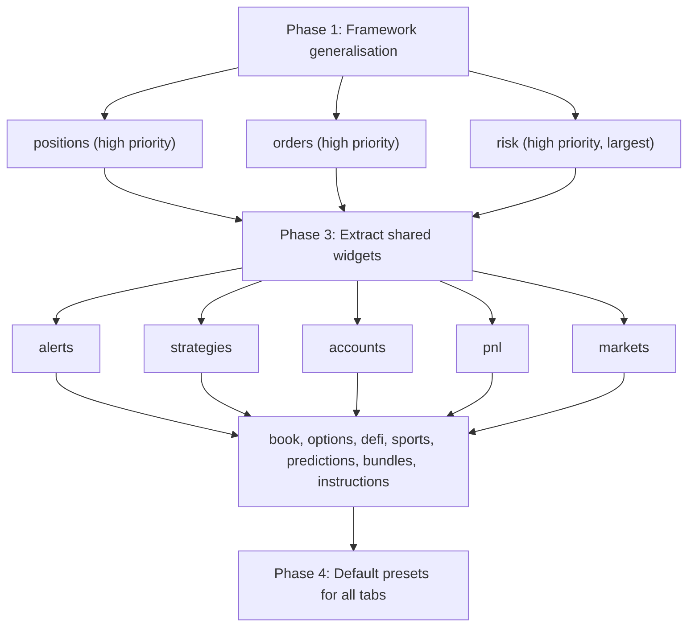

# Trading Pages Widget Rollout

## Current State

Only 2 of 18 trading pages use widgets: **overview** and **terminal**. The remaining 16 pages are monolithic `page.tsx` files (some 900-2700 lines) with hardcoded layouts. The widget infrastructure is functional but tightly coupled to those two pages.

## Phase 1: Generalise the Widget Framework

Before touching any page, make the infrastructure support N tabs with zero per-tab boilerplate in the store/layout.

### 1.1 Dynamic workspace store (no hardcoded tab list)

Currently [workspace-store.ts](lib/stores/workspace-store.ts) hardcodes `overview` and `terminal` in `buildInitialState()`. Change to:

- `buildInitialState()` returns empty `workspaces: {}` and `activeWorkspaceId: {}`
- Add an `ensureTab(tab: string)` action that lazily initialises a tab's presets from a registry the first time it's accessed
- Move preset definitions to a central `getPresetsForTab(tab)` function that each `register.ts` can contribute to

### 1.2 Preset registry

Create [components/widgets/preset-registry.ts](components/widgets/preset-registry.ts):

- `registerPresets(tab: string, presets: Workspace[])` — called from each tab's `register.ts`
- `getPresetsForTab(tab: string): Workspace[]` — consumed by the store's `ensureTab`
- Each tab always gets a "Blank Canvas" preset auto-appended

### 1.3 Expand WIDGET_TABS in trading layout

In [app/(platform)/services/trading/layout.tsx](<app/(platform)/services/trading/layout.tsx>) line 251:

- Change `WIDGET_TABS` from `["overview", "terminal"]` to include all trading sub-paths
- The `useWidgetTab()` hook derives the tab name from the pathname segment after `/trading/`
- This makes the `WorkspaceToolbar` and `widget-fullscreen-boundary` appear on every trading page automatically

### 1.4 Generic data context pattern

Currently each tab has a bespoke data context (`OverviewDataContext`, `TerminalDataContext`). For many pages the context is simpler. Establish a convention:

- Each tab folder (`components/widgets/<tab>/`) contains a `<Tab>DataProvider` that wraps the page's data hooks
- The provider is imported and wrapped around `<WidgetGrid tab="..." />` in the page file
- Widgets consume the context; no prop drilling

---

## Phase 2: Extract Widgets from Each Trading Page

For each page below, the work follows the same pattern:

1. Create `components/widgets/<tab>/` folder
2. Create `<tab>-data-context.tsx` with the page's data hooks
3. Extract each natural panel into a widget component file
4. Create `register.ts` — register widgets with the registry + register presets
5. Replace the monolithic `page.tsx` with `<DataProvider> + <WidgetGrid tab="..." />`
6. Import `register.ts` as a side-effect in `page.tsx`

### Pages and estimated widget counts

| Tab slug       | Page file (lines)         | Estimated widgets                                                                                                                              | Priority |
| -------------- | ------------------------- | ---------------------------------------------------------------------------------------------------------------------------------------------- | -------- |
| `risk`         | risk/page.tsx (2764)      | 12-15 (summary strip, VaR dashboard, exposure, Greeks, margin, term structure, limits, stress, circuit breakers, correlation heatmap, what-if) | High     |
| `positions`    | positions/page.tsx (911)  | 5-6 (filter bar, balances panel, KPI strip, positions table, execution controls)                                                               | High     |
| `orders`       | orders/page.tsx (824)     | 4-5 (filter bar, summary stats, orders table, amend dialog surface)                                                                            | High     |
| `pnl`          | pnl/page.tsx (1715)       | 6-8 (mode controls, waterfall chart, time-series, drill-down, factor PnL, client rows)                                                         | Medium   |
| `alerts`       | alerts/page.tsx (968)     | 5-6 (severity cards, filter bar, alerts table, emergency panel)                                                                                | Medium   |
| `strategies`   | strategies/page.tsx (669) | 4-5 (filter toolbar, mode toggle, strategy card grid, grid link)                                                                               | Medium   |
| `accounts`     | accounts/page.tsx (877)   | 5-6 (NAV KPIs, transfer panel, history table, margin utilization, venue balances)                                                              | Medium   |
| `markets`      | markets/page.tsx (1725)   | 8-10 (header, trade desk tab, latency tab, recon tab — each with multiple panels)                                                              | Medium   |
| `book`         | book/page.tsx (948)       | 4-5 (context bar, category tabs, order form, compliance, preview)                                                                              | Low      |
| `options`      | options/page.tsx (11)     | 1 wrapper (internals in `OptionsFuturesPanel`)                                                                                                 | Low      |
| `predictions`  | predictions/page.tsx (59) | 5 tab panels (markets, portfolio, ODUM focus, arb stream, trade)                                                                               | Low      |
| `sports`       | sports/page.tsx (7)       | 1 wrapper (internals in `SportsPage`)                                                                                                          | Low      |
| `defi`         | defi/page.tsx (19)        | 1 wrapper (internals in `DeFiOpsPanel`)                                                                                                        | Low      |
| `bundles`      | bundles/page.tsx          | TBD                                                                                                                                            | Low      |
| `instructions` | instructions/page.tsx     | TBD                                                                                                                                            | Low      |

### Thin wrapper pages (options, sports, defi, predictions)

These pages delegate to a single component. Two options:

- **Option A (recommended):** Register the entire panel as a single widget. The user can still expand it, co-tab it with other widgets, and the FOMO/entitlement gating works.
- **Option B:** Break into the panel's internals later when the team requests it.

---

## Phase 3: Shared Widget Components

Several widgets repeat across pages. Extract once, register on multiple tabs:

- **KPI Strip** — used by overview, positions, alerts, accounts, risk. Parameterise via config.
- **Filter Bar widget** — wraps the existing `FilterBar` component. Used by positions, orders, alerts.
- **Data Table widget** — generic table wrapper. Used by positions, orders, alerts.
- **Chart container** — wraps Recharts/lightweight-charts instances. Used by PnL, risk, markets.

These go in `components/widgets/shared/` and are registered with `availableOn` spanning multiple tabs.

---

## Phase 4: Default Layout Presets

For each new tab, create a "Default" preset that replicates the current fixed layout (widget positions match the existing page layout). This ensures zero regression for users who never customise.

---

## File Structure After Rollout

```
components/widgets/
  widget-registry.ts          (existing — unchanged)
  preset-registry.ts          (NEW — Phase 1)
  widget-grid.tsx             (existing — unchanged)
  widget-wrapper.tsx          (existing — unchanged)
  widget-catalog-drawer.tsx   (existing — unchanged)
  workspace-toolbar.tsx       (existing — unchanged)
  workspace-presets.ts        (DELETE — replaced by preset-registry)
  shared/                     (NEW — shared cross-tab widgets)
    kpi-strip-widget.tsx
    filter-bar-widget.tsx
    data-table-widget.tsx
  overview/                   (existing — unchanged)
  terminal/                   (existing — unchanged)
  risk/                       (NEW)
    risk-data-context.tsx
    risk-summary-widget.tsx
    var-dashboard-widget.tsx
    exposure-widget.tsx
    greeks-widget.tsx
    ...
    register.ts
  positions/                  (NEW)
    positions-data-context.tsx
    balances-widget.tsx
    positions-table-widget.tsx
    ...
    register.ts
  ... (one folder per tab)
```

---

## Implementation Order



## Key Decisions

- **No new dependencies** — everything uses existing react-grid-layout + Zustand + registry pattern
- **Refactor in place** — each page.tsx shrinks to ~10-20 lines (provider + grid); old code deleted
- **Backward compatible** — default presets replicate current layouts; non-editing users see no difference
- **localStorage migration** — the store's `ensureTab` initialises new tabs lazily, so existing users' overview/terminal layouts are preserved
