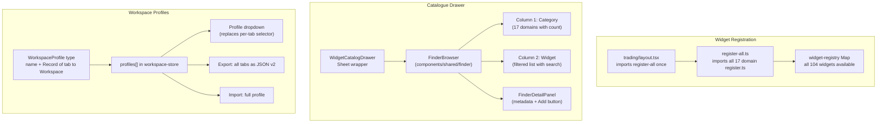
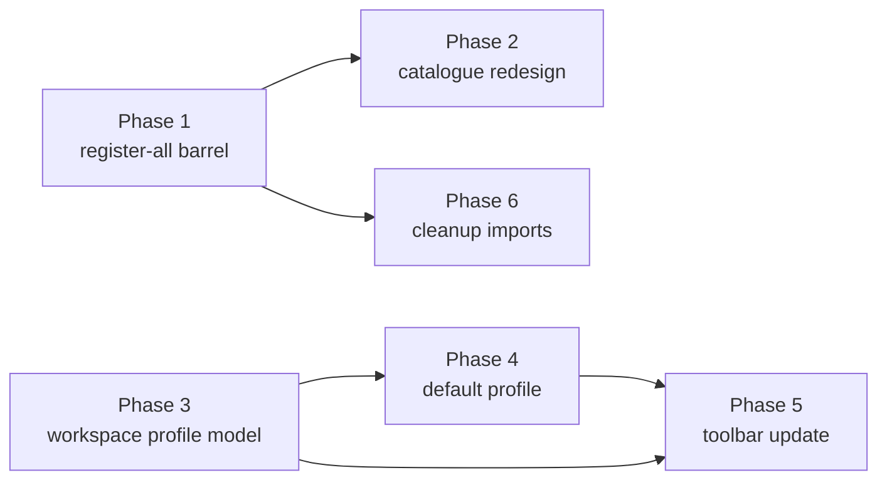

# Widget & Workspace Architecture Overhaul

## Current State

- **104 widgets** across **17 domains**, each registered lazily via side-effect `import "@/components/widgets/<domain>/register"` in individual page files
- Widget catalogue ([widget-catalog-drawer.tsx](components/widgets/widget-catalog-drawer.tsx)) calls `getAllWidgets()` which only returns widgets registered so far — so it shows different widgets depending on which page you're on
- `WorkspaceToolbar` only renders inside [trading/layout.tsx](<app/(platform)/services/trading/layout.tsx>) via `useWidgetTab()` — no other service area gets the toolbar
- Workspace store ([workspace-store.ts](lib/stores/workspace-store.ts)) is entirely **per-tab**: `workspaces: Record<string, Workspace[]>`, `activeWorkspaceId: Record<string, string>`, export/import scoped to single tab
- Presets are registered per-tab in each `register.ts` — no cross-tab "workspace profile" concept
- Export downloads one tab's active workspace as JSON; import adds to one tab

## Target Architecture



---

## Phase 1: Widget Registration Barrel (make all widgets visible everywhere)

**Goal:** All 104 widgets appear in the catalogue regardless of which page the user is on.

**Files to create:**

- `components/widgets/register-all.ts` — barrel that side-effect imports all 17 `register.ts` files

```typescript
import "./accounts/register";
import "./alerts/register";
import "./book/register";
import "./bundles/register";
import "./defi/register";
import "./instructions/register";
import "./markets/register";
import "./options/register";
import "./orders/register";
import "./overview/register";
import "./pnl/register";
import "./positions/register";
import "./predictions/register";
import "./risk/register";
import "./sports/register";
import "./strategies/register";
import "./terminal/register";
```

**Files to change:**

- [app/(platform)/services/trading/layout.tsx](<app/(platform)/services/trading/layout.tsx>) — add `import "@/components/widgets/register-all"` at top, replacing the need for per-page imports
- All 17 trading page files — **remove** their individual `import "@/components/widgets/<domain>/register"` lines (the barrel handles it now)

**Risk note:** Each `register.ts` also calls `registerPresets()` — all presets will now load for all tabs at startup. This is correct behavior since `getPresetsForTab(tab)` filters by tab key anyway. Bundle size increases slightly but all widget components are already `React.lazy` wrapped or lightweight registration objects (the `component` field is a lazy reference).

---

## Phase 2: Redesign Widget Catalogue Using Existing Finder Component

**Goal:** Replace the current flat catalogue drawer with the existing `FinderBrowser` component from `components/shared/finder/`. This gives us multi-column drill-down, detail panel, breadcrumb, context strip, search, and resizable columns for free.

**Existing Finder infrastructure (already built):**

- [components/shared/finder/finder-browser.tsx](components/shared/finder/finder-browser.tsx) — main layout: columns + detail panel + context strip + breadcrumb
- [components/shared/finder/finder-detail-panel.tsx](components/shared/finder/finder-detail-panel.tsx) — collapsible right panel
- [components/shared/finder/finder-column.tsx](components/shared/finder/finder-column.tsx) — scrollable column with per-column search
- [components/shared/finder/types.ts](components/shared/finder/types.ts) — `FinderColumnDef`, `FinderItem`, `FinderSelections`, `FinderBrowserProps`

**Reference usage:** [app/(platform)/services/data/processing/page.tsx](<app/(platform)/services/data/processing/page.tsx>) — uses `FinderBrowser` with `PROCESSING_COLUMNS`, `detailPanel`, `contextStats`, and `emptyState`.

**File to rewrite:** [components/widgets/widget-catalog-drawer.tsx](components/widgets/widget-catalog-drawer.tsx) (194 lines)

**New layout (FinderBrowser inside Sheet):**

```
+-------------------------------------------------------------------+
| Widget Catalog                                              [X]    |
+------------+-----------------------+-----------------------------+
| CONTEXT    | 104 widgets · 17 domains · 3 locked                  |
+------------+-----------------------+-----------------------------+
| Breadcrumb: All > P&L > Waterfall                                  |
+------------+-----------------------+-----------------------------+
| Category   | Widget                | DETAIL PANEL                |
| (column 1) | (column 2)            | (FinderDetailPanel)         |
|            |                       |                             |
| Positions 3| > PnL Controls       | [icon] PnL Waterfall        |
| Orders    2|   PnL Waterfall  [*] | "Waterfall breakdown..."    |
| Alerts    3|   PnL Time Series    |                             |
| P&L      >6|   PnL By Client      | Category: P&L               |
| Risk     13|   PnL Factor DD      | Size: 6x4 (min 3x2)        |
| Markets   8|   PnL Report Button  | Available on: pnl           |
| ...        |                       | Entitlements: execution     |
|            |                       | Singleton: No               |
|            |                       |                             |
|            |                       | [Add to Workspace]          |
+------------+-----------------------+-----------------------------+
```

**Implementation approach:**

1. **Define two `FinderColumnDef` columns:**

- **Column 1 "Category"**: `getItems()` returns one `FinderItem` per unique `category` from `getAllWidgets()`, with `count` = number of widgets in that category. Fixed width `w-[180px]`.
- **Column 2 "Widget"**: `getItems(selections)` filters `getAllWidgets()` by `selections["category"]?.label`, returning one `FinderItem<WidgetDefinition>` per widget. Shows lock/added badges via `renderLabel`. Has `showSearch: true`. Width `flex-1`.

1. **Detail panel:** `detailPanel(selections)` renders the selected widget's full details:

- Icon, label, description
- Category, default size (`defaultW x defaultH`), min size (`minW x minH`)
- `availableOn` tabs as badges
- `requiredEntitlements` as badges (with lock state)
- Singleton flag
- **"Add to Workspace" button** — calls `addWidget(tab, widgetId)`, disabled if singleton and already placed

1. **Context stats:** `contextStats(selections)` returns total widget count, domain count, locked count (based on entitlements).
2. **Sheet width:** Increase from `w-[360px] sm:w-[400px]` to `w-[720px] sm:w-[780px]` to fit the Finder layout.
3. **Config file:** Create `components/widgets/widget-catalog-finder-config.ts` for the column definitions and context stats function (same pattern as `components/data/processing-finder-config.ts`).

---

## Phase 3: Workspace Profile Model (cross-tab workspaces)

**Goal:** A "workspace profile" bundles all tabs. Selecting a profile applies to all pages. Export/import operates on profiles.

**File to change:** [lib/stores/workspace-store.ts](lib/stores/workspace-store.ts)

**New type:**

```typescript
export interface WorkspaceProfile {
  id: string;
  name: string;
  isPreset: boolean;
  /** One workspace per tab — keys are tab strings (e.g. "positions", "overview") */
  tabs: Record<string, Workspace>;
  createdAt: string;
  updatedAt: string;
}
```

**Store changes:**

Current per-tab model stays for internal layout management (it works well for `WidgetGrid` which is always tab-scoped). The profile layer sits **on top**:

- **New state fields:**
  - `profiles: WorkspaceProfile[]` — the list of all profiles (preset + user-created)
  - `activeProfileId: string` — which profile is active
- **New actions:**
  - `setActiveProfile(profileId)` — sets `activeProfileId`, then for each tab in `profile.tabs`, sets `activeWorkspaceId[tab]` to the corresponding workspace ID and ensures that workspace exists in `workspaces[tab]`
  - `exportProfile(profileId): string` — serializes `{ version: 2, profile: WorkspaceProfile }` with all tabs
  - `importProfile(json): boolean` — parses, creates new profile, materializes workspaces into `workspaces[tab]` for each tab, activates it
  - `saveCurrentAsProfile(name)` — snapshots the current `activeWorkspaceId` across all tabs into a new `WorkspaceProfile`
  - `deleteProfile(profileId)` — removes profile (not the underlying workspaces, which may be shared)
  - `duplicateProfile(profileId, newName)` — clone with new name
- **Migration:** On first load (no profiles in persisted state), auto-create a "Custom" profile from the existing `activeWorkspaceId` map so users don't lose their current layouts.
- **Persist:** Add `profiles` and `activeProfileId` to `partialize`.

---

## Phase 4: Default Workspace Profile

**Goal:** A built-in "Default" profile that provides sensible widget layouts for every tab.

**File to create:** `components/widgets/default-profile.ts`

This file defines a `WorkspaceProfile` with one `Workspace` per tab, using the existing preset layouts already defined in each domain's `register.ts`. Logic:

```typescript
export function buildDefaultProfile(): WorkspaceProfile {
  const tabs: Record<string, Workspace> = {};
  for (const tab of ALL_WIDGET_TABS) {
    const presets = getPresetsForTab(tab);
    const defaultPreset = presets.find(p => p.name === "Default") ?? presets[0];
    if (defaultPreset) {
      tabs[tab] = { ...defaultPreset };
    }
  }
  return { id: "default", name: "Default", isPreset: true, tabs, ... };
}
```

`ALL_WIDGET_TABS` is an array of all 17 tab strings. This profile is registered in the store's `buildInitialState()` or on first `ensureTab`.

**Custom panels:** When a user creates a custom panel, it gets added to the active profile's `tabs` map automatically.

---

## Phase 5: Update Toolbar (Profile Selector + Full Export/Import)

**Goal:** WorkspaceToolbar shows profile-level controls instead of per-tab workspace selector.

**File to change:** [components/widgets/workspace-toolbar.tsx](components/widgets/workspace-toolbar.tsx)

**Changes:**

- **Profile selector** (left side): `<Select>` shows profiles ("Default", "My Layout", etc.) instead of per-tab workspaces. `onValueChange` calls `setActiveProfile(profileId)`.
- **Per-tab workspace selector** (optional, secondary): Keep the existing per-tab dropdown as a smaller secondary control for power users who want different workspaces on different tabs within a profile — or remove entirely for simplicity. Recommend: keep it as an "advanced" option in the `...` menu.
- **Export JSON**: calls `exportProfile(activeProfileId)` — downloads all tabs as one JSON.
- **Import JSON**: calls `importProfile(json)` — loads full profile, activates it.
- **Save As**: calls `saveCurrentAsProfile(name)` — snapshots all current tab layouts.
- Rest (Add Widget, Edit mode, Undo, Snapshot, History) remain tab-scoped as they are — they're layout editing tools for the current view.

---

## Phase 6: Remove Per-Page Register Imports (cleanup)

Once Phase 1's `register-all.ts` barrel is confirmed working, remove the 17 individual `import "@/components/widgets/<domain>/register"` lines from each page file. These files stay otherwise unchanged (they still render `WidgetGrid tab="..."` and may wrap with domain DataProviders).

Pages to clean up:

- `app/(platform)/services/trading/positions/page.tsx`
- `app/(platform)/services/trading/orders/page.tsx`
- `app/(platform)/services/trading/terminal/page.tsx`
- `app/(platform)/services/trading/alerts/page.tsx`
- `app/(platform)/services/trading/strategies/page.tsx`
- `app/(platform)/services/trading/risk/page.tsx`
- `app/(platform)/services/trading/pnl/page.tsx`
- `app/(platform)/services/trading/markets/page.tsx`
- `app/(platform)/services/trading/sports/page.tsx`
- `app/(platform)/services/trading/predictions/page.tsx`
- `app/(platform)/services/trading/book/page.tsx`
- `app/(platform)/services/trading/instructions/page.tsx`
- `app/(platform)/services/trading/accounts/page.tsx`
- `app/(platform)/services/trading/defi/page.tsx`
- `app/(platform)/services/trading/options/page.tsx`
- `app/(platform)/services/trading/bundles/page.tsx`
- `app/(platform)/services/trading/overview/page.tsx`

---

## Execution Order and Dependencies



- Phases 1+2 (catalogue) and Phases 3+4+5 (workspace profiles) are **independent tracks** — can be worked in parallel
- Phase 6 (cleanup) depends only on Phase 1 being verified
- Total estimated scope: ~800-1000 lines changed across ~25 files

## What This Plan Does NOT Cover (deferred)

- **Widget merging (4.1-4.10):** Per your direction, "not aggressive" — evaluate once all widgets are visible. Existing merge candidates in WORK_TRACKER remain as separate future tasks.
- **Additional themed profiles** (Compact, Trader, etc.): Future work per your direction.
- **WorkspaceToolbar on non-trading pages**: Only relevant if/when non-trading pages adopt WidgetGrid.
- **Filter state in profiles (7.2):** Saving Org/Client/Strategy in profile — separate task that depends on this work being done first.
