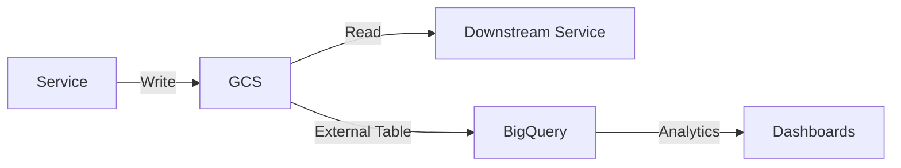
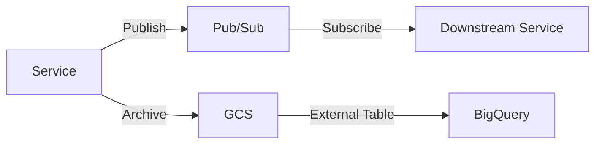

# Data

**Schema governance, storage patterns, and data quality standards for the Unified Trading System.**

## TL;DR

All data follows standardized schemas (Pydantic), is partitioned by date (YYYY/MM/DD), stored in GCS (batch) or Pub/Sub
(live), and validated before persistence. Service-owned schemas ensure loose coupling while unified-trading-services
provides cross-cutting schemas (events, config).

---

## Core Principles

### 1. Schema Governance

**Service-owned schemas:** Each service defines its own output schemas in `schemas/output_schemas.py`:

```python
from pydantic import BaseModel, Field
from datetime import datetime
from decimal import Decimal

class FeatureRow(BaseModel):
    """Output schema for features-delta-one-service."""
    timestamp: datetime
    instrument_id: str
    momentum_5m: Decimal
    momentum_1h: Decimal
    rsi_14: Decimal
    # ... more features
```

**Cross-cutting schemas:** unified-trading-services owns:

- Lifecycle events (11 standard events)
- Configuration base classes (UnifiedCloudServicesConfig)
- Common types (InstrumentKey, Venue, InstrumentType)

**Benefits:**

- Services evolve schemas independently
- Strict validation at service boundaries
- Breaking changes are explicit
- Consumers know what to expect

See [schema-governance.md](schema-governance.md) for details.

---

### 2. GCS Data Layout

All batch data follows standardized partitioning:

```
gs://{bucket}/YYYY/MM/DD/{filename}.parquet
```

**Example:**

```
gs://instruments/2025/01/15/instruments.parquet
gs://market-data-ohlcv/2025/01/15/ohlcv_1m.parquet
gs://features-delta-one/2025/01/15/features.parquet
gs://ml-predictions/2025/01/15/predictions.parquet
gs://orders/2025/01/15/orders.parquet
```

**Benefits:**

- Time-travel queries (read any historical date)
- Efficient pruning (query planner skips irrelevant partitions)
- Consistent paths across all services
- Easy to implement date-based retention policies

See [partitioning.md](partitioning.md) for details.

**Bucket naming:** Buckets use `{prefix}-{gcp_project_id}`. Use `GCP_PROJECT_ID` (canonical). See
[bucket-naming-and-config.md](bucket-naming-and-config.md).

---

### 3. Pub/Sub for Live Data

Live services publish to Pub/Sub topics:

```
projects/{project}/topics/{topic-name}
```

**Core topics:**

| Topic                 | Producer                   | Schema               | Retention |
| --------------------- | -------------------------- | -------------------- | --------- |
| `instruments-updates` | instruments-service        | InstrumentDefinition | 7 days    |
| `market-ticks`        | market-tick-data-service   | CanonicalTrade       | 1 day     |
| `market-ohlcv`        | market-data-processing     | OHLCVCandle          | 7 days    |
| `features-delta-one`  | features-delta-one-service | FeatureRow           | 7 days    |
| `features-sports`     | features-sports-service    | SportsFeatureVector  | 7 days    |
| `ml-predictions`      | ml-inference-service       | Prediction           | 7 days    |
| `strategy-signals`    | strategy-service           | StrategyInstruction  | 30 days   |
| `order-requests`      | execution-service          | Order                | 30 days   |
| `position-updates`    | execution-service          | Position             | 30 days   |
| `risk-metrics`        | risk-and-exposure          | RiskMetrics          | 30 days   |

**Benefits:**

- Decoupled producers and consumers
- Multiple consumers per topic
- Replay for debugging
- Automatic retries and dead-letter queues

See [subscription-model.md](subscription-model.md) for details.

---

### 4. Pre-Upload Validation

All services validate data before writing to GCS:

```python
from unified_trading_services import validate_timestamp_date_alignment

def save_features_for_date(date: datetime, features: pd.DataFrame):
    """Save features with validation."""

    # 1. Schema validation (Pydantic)
    for _, row in features.iterrows():
        FeatureRow(**row.to_dict())  # Raises ValidationError if invalid

    # 2. Timestamp-date alignment
    validate_timestamp_date_alignment(
        df=features,
        date=date,
        timestamp_column="timestamp",
    )

    # 3. Write to GCS
    path = f"gs://features-delta-one/{date:%Y/%m/%d}/features.parquet"
    write_parquet(path, features)
```

**Catches:**

- Schema violations (missing fields, wrong types)
- Timestamps outside date range
- Duplicate rows
- NaN/infinity values in critical columns

---

## Data Quality Standards

### Completeness

All services report data completeness metrics:

```python
expected_instruments = 500
actual_instruments = len(df["instrument_id"].unique())
completeness = actual_instruments / expected_instruments

if completeness < 0.95:  # < 95%
    log_event("DATA_QUALITY_WARNING", {
        "metric": "completeness",
        "expected": expected_instruments,
        "actual": actual_instruments,
        "completeness": f"{completeness:.1%}",
    })
```

### Freshness

Data age is monitored:

```python
latest_timestamp = df["timestamp"].max()
age = datetime.now(timezone.utc) - latest_timestamp

if age > timedelta(minutes=5):
    log_event("DATA_FRESHNESS_WARNING", {
        "metric": "freshness",
        "age_seconds": age.total_seconds(),
    })
```

### Accuracy

Schema validation ensures type correctness. Services also implement domain-specific checks:

```python
# Price sanity check
if df["price"].min() <= 0 or df["price"].max() > 1_000_000:
    log_event("DATA_ACCURACY_ERROR", {
        "metric": "price_range",
        "min": float(df["price"].min()),
        "max": float(df["price"].max()),
    })
```

---

## Data Schemas by Service

| Service                  | Output Schema        | Key Fields                                          | Format  |
| ------------------------ | -------------------- | --------------------------------------------------- | ------- |
| instruments-service      | InstrumentDefinition | id, venue, type, symbol                             | Parquet |
| market-tick-data-service | CanonicalTrade       | timestamp, instrument_id, price, qty                | Parquet |
| market-data-processing   | OHLCVCandle          | timestamp, instrument_id, OHLCV                     | Parquet |
| features-calendar        | CalendarFeatures     | timestamp, day_of_week, holiday                     | Parquet |
| features-delta-one       | FeatureRow           | timestamp, instrument_id, features                  | Parquet |
| features-volatility      | VolatilityFeatures   | timestamp, instrument_id, realized_vol, implied_vol | Parquet |
| features-onchain         | OnchainFeatures      | timestamp, protocol, tvl, revenue                   | Parquet |
| features-sports          | SportsFeatures       | timestamp, game_id, team_stats, odds                | Parquet |
| ml-training              | ModelMetadata        | model_id, version, metrics, hyperparams             | JSON    |
| ml-inference             | Prediction           | timestamp, instrument_id, prediction, confidence    | Parquet |
| strategy-service         | StrategyInstruction  | timestamp, instrument_id, direction, target         | Parquet |
| execution-service        | Order                | order_id, instrument_id, side, qty, price, status   | Parquet |

---

## Data Retention Policies

| Data Type      | Retention (GCS) | Retention (Pub/Sub) | Reason                            |
| -------------- | --------------- | ------------------- | --------------------------------- |
| Instruments    | Forever         | 7 days              | Reference data                    |
| Tick data      | 90 days         | 1 day               | Storage cost, aggregated to OHLCV |
| OHLCV (1m, 5m) | 1 year          | 7 days              | Short-term analysis               |
| OHLCV (1h, 1d) | Forever         | 7 days              | Long-term backtesting             |
| Features       | 1 year          | 7 days              | ML training, reprocessable        |
| ML predictions | 90 days         | 7 days              | Strategy debugging                |
| Orders         | Forever         | 30 days             | Regulatory, audit trail           |
| Positions      | Forever         | 30 days             | P&L attribution                   |
| Risk metrics   | 90 days         | 30 days             | Compliance monitoring             |

---

## Directory Structure

```
02-data/
├── README.md (this file)
├── bucket-naming-and-config.md     # GCP_PROJECT_ID canonical, bucket prefix + project ID
├── schema-governance.md            # Service-owned schemas, validation patterns
├── partitioning.md                 # GCS partitioning strategy (YYYY/MM/DD)
├── subscription-model.md           # Pub/Sub topics, message formats
├── hive-schema-compatibility.md    # BigQuery external table compatibility
├── sports-data-sources.md          # Sports API integrations (DraftKings, FanDuel, etc.)
├── sports-schema-paths.md          # Sports features/odds canonical paths, validation
├── sports-data-migration.md        # sports-betting-services → unified GCS migration
├── sports-api-testing.md           # Sports API testing, mock data
├── _common/                        # Common patterns across batch/live
├── batch/                          # Batch-specific data patterns
└── live/                           # Live-specific data patterns
```

---

## Data Flow

### Batch Mode



### Live Mode



---

## Related Sections

- **[01-domain](../01-domain/)** - Domain model, ubiquitous language
- **[03-observability](../03-observability/)** - Event logging, data quality monitoring
- **[04-architecture](../04-architecture/)** - Batch-live symmetry
- **[07-services](../07-services/)** - Per-service schemas
