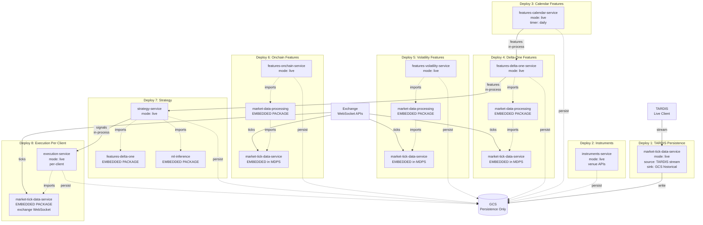
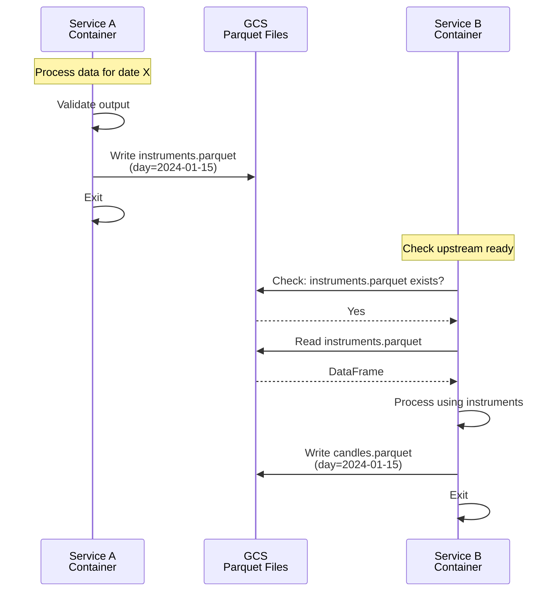
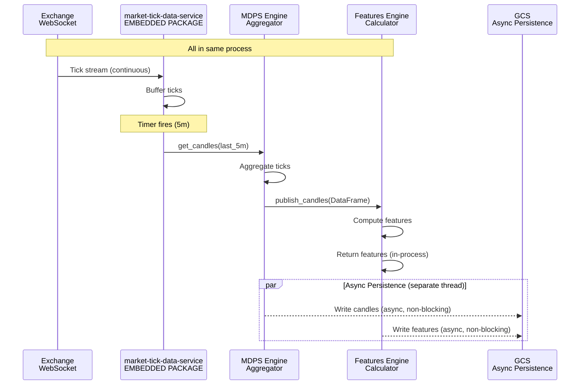
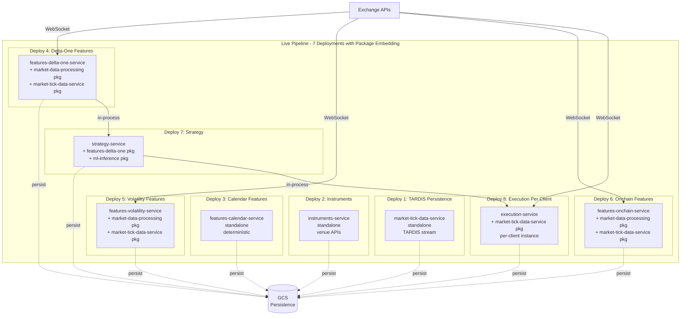
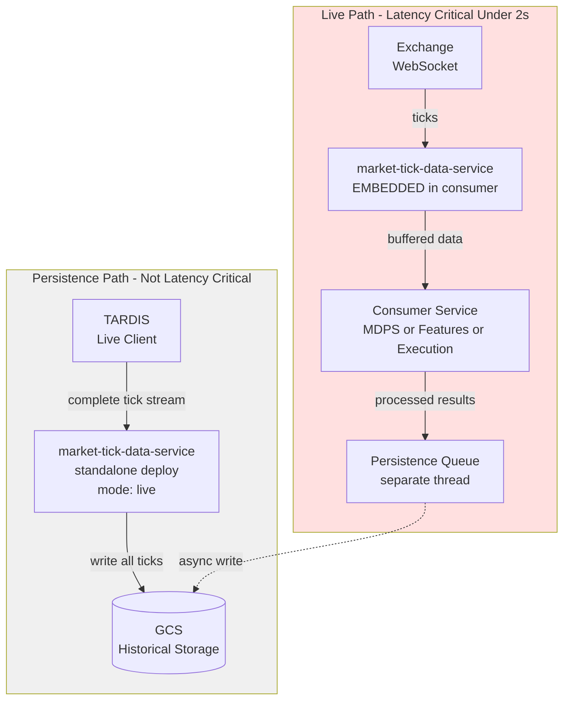
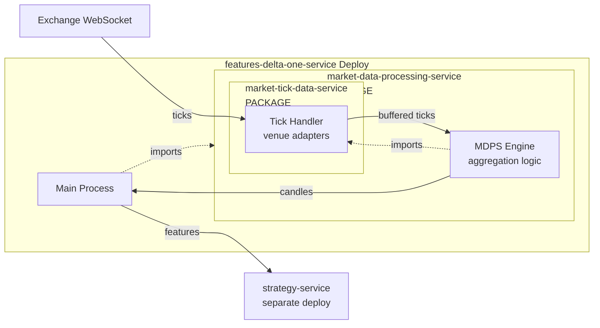
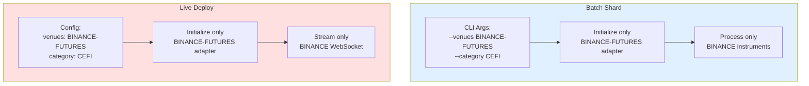
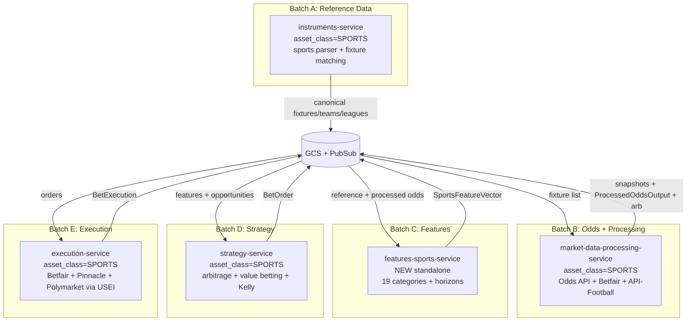

# Deployment Topology Diagrams

Visual reference for batch vs live deployment models, service aggregation patterns, and messaging structure.

---

## Batch Deployment: Independent Containers via GCS

In batch mode, every service is a separate container. Communication is exclusively through GCS Parquet files.

```mermaid
graph TD
    subgraph Layer1[Layer 1: Data Ingestion]
        Instruments[instruments-service<br/>Container]
        Calendar[features-calendar-service<br/>Container]
    end

    subgraph Layer2[Layer 2: Raw Market Data]
        CorporateActions[instruments-service (corporate-actions domain)<br/>Container]
        TickHandler[market-tick-data-service<br/>Container]
    end

    subgraph Layer3[Layer 3: Processed Data]
        MDPS[market-data-processing-service<br/>Container]
    end

    subgraph Layer4[Layer 4: Features]
        FeatDelta[features-delta-one-service<br/>Container]
        FeatVol[features-volatility-service<br/>Container]
        FeatOnchain[features-onchain-service<br/>Container]
    end

    subgraph Layer5[Layer 5: ML]
        MLTrain[ml-training-service<br/>Container]
        MLInfer[ml-inference-service<br/>Container]
    end

    subgraph Layer6[Layer 6: Execution]
        Strategy[strategy-service<br/>Container]
        Execution[execution-service<br/>Container]
    end

    GCS[(GCS Parquet<br/>Message Bus)]

    Instruments -->|write| GCS
    GCS -->|read| CorporateActions
    GCS -->|read| TickHandler

    TickHandler -->|write| GCS
    GCS -->|read| MDPS

    MDPS -->|write| GCS
    Calendar -->|write| GCS

    GCS -->|read| FeatDelta
    GCS -->|read| FeatVol
    GCS -->|read| FeatOnchain

    FeatDelta -->|write| GCS
    FeatVol -->|write| GCS
    FeatOnchain -->|write| GCS

    GCS -->|read| MLTrain
    MLTrain -->|write models| GCS
    GCS -->|read| MLInfer
    MLInfer -->|write predictions| GCS

    GCS -->|read| Strategy
    Strategy -->|write signals| GCS

    GCS -->|read| Execution
    Execution -->|write results| GCS
```

**Key characteristics:**

- Each box is an independent container (VM or Cloud Run job)
- Containers start, read input, process, write output, and exit
- GCS is the only communication mechanism
- Any service can be restarted without affecting others
- Sharding: category x venue x date -- each shard is a separate container

---

## Live Deployment: Package Embedding for Low Latency

In live mode, services embed upstream packages to avoid network hops on the hot path. This creates a 7-8 deployment
topology.



**Key characteristics:**

- Solid boxes = separate deployments (containers/VMs)
- Dotted "imports" arrows = package embedding (in-process, no network)
- Solid data arrows = data flow (in-process function calls or async persistence)
- Each feature service embeds market-data-processing, which embeds market-tick-data-service
- Each deployment only connects to the venues it needs (selective venue initialization)
- TARDIS persistence is separate from the latency path
- GCS is for persistence only, not for inter-service communication

---

## Messaging Structure: Batch vs Live

### Batch Messaging (GCS Pull Model)



**Pull-based**: Service B pulls data from GCS when it is ready to process. Service A has already exited. No coordination
needed.

### Live Messaging (Package Embedding Push Model)



**Push-based**: Upstream components publish data via in-process function calls. Downstream components receive results
synchronously. Persistence happens asynchronously on a separate thread and never blocks the hot path.

---

## Service Aggregation: Batch vs Live

### Batch: No Aggregation (12 Separate Containers)

```mermaid
graph LR
    subgraph Batch[Batch Pipeline - 12 Independent Deployments]
        direction TB
        B1[instruments-service]
        B2[instruments-service (corporate-actions domain)]
        B3[market-tick-data-service]
        B4[market-data-processing]
        B5[features-calendar]
        B6[features-delta-one]
        B7[features-volatility]
        B8[features-onchain]
        B9[ml-training]
        B10[ml-inference]
        B11[strategy-service]
        B12[execution-service]
    end

    GCSBatch[(GCS<br/>All Communication)]

    B1 --> GCSBatch
    GCSBatch --> B2
    GCSBatch --> B3
    GCSBatch --> B4
    GCSBatch --> B5
    GCSBatch --> B6
    GCSBatch --> B7
    GCSBatch --> B8
    GCSBatch --> B9
    GCSBatch --> B10
    GCSBatch --> B11
    GCSBatch --> B12
```

**12 separate deployments**, each reading from and writing to GCS. No shared memory, no process coupling.

### Live: Package Aggregation (7 Deployments via Embedding)



**8 deployments** (7 core + 1 per-client execution). Market-tick-data-handler runs as an embedded package in 4 places.
Market-data-processing runs as an embedded package in 3 feature services. Each deployment only initializes venues it
needs.

---

## Persistence vs Live Path



**Two independent paths:**

- **Persistence path** (TARDIS): complete historical-grade data, stored for replay and compliance. Runs continuously but
  not latency-sensitive.
- **Live path** (Exchange WebSocket): real-time data for trading, embedded as packages, latency-critical (<2s
  end-to-end). Async persistence on separate thread.

We store data once (TARDIS persistence) but consume it in two places (embedded packages for speed). GCP doesn't charge
for data ingestion, so duplicate WebSocket connections are cost-acceptable.

---

## Package Embedding Pattern



**Nested package embedding:**

- `features-delta-one-service` imports `market-data-processing-service` as a package
- `market-data-processing-service` imports `market-tick-data-service` as a package
- All three run in the same process
- Exchange ticks flow: WebSocket -> tick handler package -> MDPS package -> features main process
- Zero network hops, all in-memory function calls

---

## Selective Venue Initialization

Both batch and live use the same sharding/filtering principle: **only initialize venues you need**.



**Same principle, different input:**

- Batch: CLI args specify venues (shard dimension)
- Live: config specifies venues (deployment parameter)
- Result: both modes only initialize the venue adapters they need, minimizing resource usage and connection overhead

Already implemented in instruments-service. Being applied to market-tick-data-service. Should be universal across all
services with venue-specific logic.

---

## Sports Pipeline — Batch Deployment (Consolidated, 2026-03-01)

Sports data flows through the **existing** batch pipeline services, not separate sports-specific services. The 4
sports-specific pipeline services (`sports-reference-data-service`, `sports-odds-processing-service`,
`sports-strategy-service`, `sports-execution-service`) are **DEPRECATED/ARCHIVED** as of 2026-03-01. Only
`features-sports-service` and `unified-sports-execution-interface` (USEI) remain as standalone.



**Ordering:** Batch A D5 -> Batch B D5 -> Batch C D5 -> Batch D D5 -> Batch E D5. See
`04-architecture/sports-integration-plan.md` Phase 3 (consolidated).

**Key difference from original plan:** No separate sports service containers. Sports is a category/asset_class within
each existing service, following the same sharding model (category x venue x date).
