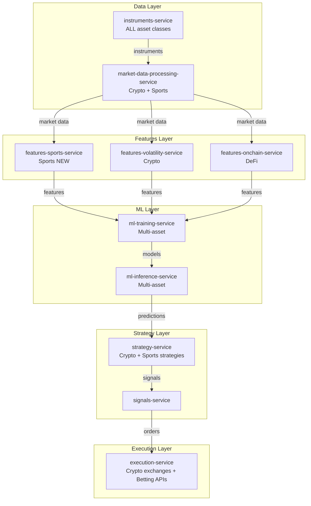

# Sports Integration Plan

## Overview

This document defines the integration strategy for the SPORTS asset class (football/soccer betting) into the unified
trading system. Sports is treated as an **asset class** alongside CRYPTO_CEFI, DEFI, and TRADFI, enabling maximum code
reuse and minimal new services.

---

## Key Principle

**Sports is an asset class, not a separate system.**

Just as the system handles BTC spot (CRYPTO_CEFI) and WETH-USDC swaps (DEFI), it will handle Liverpool vs. Crystal
Palace match odds (SPORTS). Same microservices architecture, same batch-live symmetry, same observability standards.

---

## Target Architecture



---

## Service Integration Summary

| Service                        | Change Type | Key Additions                                                |
| ------------------------------ | ----------- | ------------------------------------------------------------ |
| instruments-service            | AUGMENT     | Sports parser, fixture matching, team normalization          |
| market-data-processing-service | AUGMENT     | Odds API (batch), Betfair Stream (live), API-Football        |
| **features-sports-service**    | **CREATE**  | 19 feature categories, time horizons (T-24h, T-60m, T-0, HT) |
| ml-training-service            | AUGMENT     | Sports configs, walk-forward validation (k-fold + standard)  |
| ml-inference-service           | AUGMENT     | Sports model loading, prediction endpoint                    |
| strategy-service               | AUGMENT     | Arbitrage, value betting, Kelly criterion                    |
| execution-service              | AUGMENT     | Betfair, Pinnacle, Polymarket API clients                    |
| All UIs                        | AUGMENT     | Asset class filter, sports-specific views                    |

---

## Sports Instrument Format

### Instrument Key Structure

```
FOOTBALL:BETFAIR:MATCH_ODDS:ENG-PREMIER_LEAGUE:2018-2019:LIVERPOOL-C_PALACE::LIVERPOOL
FOOTBALL:PINNACLE:OVER_UNDER_2_5:ENG-PREMIER_LEAGUE:2018-2019:ARSENAL-CHELSEA::OVER
FOOTBALL:POLYMARKET:MATCH_WINNER:UNKNOWN:2024-2025:TEAM_A-TEAM_B::TEAM_A
```

**Components:**

1. **Asset class:** FOOTBALL
2. **Venue:** BETFAIR, PINNACLE, POLYMARKET
3. **Market type:** MATCH_ODDS, OVER_UNDER_2_5, ASIAN_HANDICAP, CORRECT_SCORE
4. **League:** ENG-PREMIER_LEAGUE, ESP-LA_LIGA, etc.
5. **Season:** 2018-2019 (season-based, not dates)
6. **Fixture:** HOME_TEAM-AWAY_TEAM
7. **Selection:** HOME, DRAW, AWAY, OVER, UNDER, etc.

### Fixture Matching

**Challenge:** Different providers use different IDs for same fixture

**Solution:** Canonical fixture ID from API-Football, mapping table for cross-provider matching

**Example:**

- Betfair market: `1.123456789`
- Odds API event: `abc123def456`
- API-Football fixture: `867530`
- **Canonical ID:** `867530` (API-Football)

**Mapping table:**

```python
{
  "api_football_id": "867530",
  "betfair_market_id": "1.123456789",
  "odds_api_id": "abc123def456",
  "home_team": "LIVERPOOL",
  "away_team": "C_PALACE",
  "league": "ENG-PREMIER_LEAGUE",
  "season": "2018-2019",
  "kickoff": "2019-01-19T17:30:00Z"
}
```

---

## Data Sources

### Batch Mode (Historical Data)

| Source           | Purpose                          | Update Frequency    | Cost                |
| ---------------- | -------------------------------- | ------------------- | ------------------- |
| **Odds API**     | Historical odds (15+ bookmakers) | Historical backfill | $200/month          |
| **API-Football** | Fixtures, teams, lineups, stats  | Daily               | $50/month           |
| **FootyStats**   | Match stats, referee data        | Daily               | Free tier available |
| **Understat**    | xG data (5 leagues)              | Daily               | Free (scraping)     |

### Live Mode (Real-Time Data)

| Source                 | Purpose                    | Protocol       | Cost                         |
| ---------------------- | -------------------------- | -------------- | ---------------------------- |
| **Betfair Stream API** | Live odds (best liquidity) | WebSocket      | Free (with betting activity) |
| **Pinnacle API**       | Sharp odds (CLV reference) | REST + polling | Free                         |
| **Polymarket**         | Prediction market odds     | WebSocket      | Free                         |

---

## Features: 19 Categories + Time Horizons

### Time Horizons

**Key insight:** Feature values change as kickoff approaches (opening odds vs closing odds)

| Horizon   | Description               | Use Case                                |
| --------- | ------------------------- | --------------------------------------- |
| **T-24h** | 24 hours before kickoff   | Opening odds, early value               |
| **T-60m** | 60 minutes before kickoff | Pre-match sharp odds                    |
| **T-0**   | At kickoff                | Closing odds, late injuries             |
| **HT**    | Half-time                 | In-play betting, second half prediction |

### Feature Categories

1. **Team features** (form, goals, xG, shots, possession)
2. **League context** (position, average goals, home advantage)
3. **Head-to-head** (H2H history)
4. **Odds features** (implied probs, market efficiency, CLV)
5. **Halftime patterns** (scoring in specific periods)
6. **Goal timing** (early goals, late goals)
7. **Referee tendencies** (cards, penalties)
8. **Venue context** (home advantage, travel distance)
9. **Weather** (rain, temperature)
10. **Season context** (start/mid/end season form)
11. **Advanced stats** (PPDA, pressing intensity)
12. **Multi-source xG** (Understat, FotMob, StatsBomb)
13. **Poisson xG** (goal scoring probability)
14. **Player lineups** (injuries, suspensions, rotation)

---

## features-sports-service (New Service)

### Purpose

Compute 19 feature categories for football betting, with horizon support (T-24h, T-60m, T-0, HT)

### Storage Structure

```
gs://features-sports/
├── t24h/{league}/{season}/{feature_group}.parquet
├── t60m/{league}/{season}/{feature_group}.parquet
├── t0/{league}/{season}/{feature_group}.parquet
└── ht/{league}/{season}/{feature_group}.parquet
```

### Anti-Leakage Validation

**Critical:** Ensure no future data leaks into features

**Validation:**

- T-24h features: Only data from **before** T-24h
- T-60m features: Only data from **before** T-60m
- T-0 features: Only data from **before** kickoff
- HT features: Only data from first half

**Implementation:**

```python
def validate_no_leakage(fixture, features, horizon):
    cutoff_time = fixture.kickoff - timedelta(hours=horizon_hours[horizon])
    for feature_name, feature_value in features.items():
        if feature_value.timestamp > cutoff_time:
            raise LeakageError(f"{feature_name} uses data after cutoff: {feature_value.timestamp} > {cutoff_time}")
```

---

## ML Training: Walk-Forward Validation

### Training Modes

#### K-Fold Walk-Forward

**When to use:** Limited data (1-2 seasons)

**Mechanism:**

1. Split into K folds (e.g., 4)
2. Train on folds 1-3, validate on fold 4
3. Roll forward: Train on folds 2-4, validate on fold 5
4. **Gap between folds:** 7 days (avoid leakage)

#### Standard Walk-Forward

**When to use:** Abundant data (5+ seasons)

**Mechanism:**

1. Train on Season 1-3, validate on Season 4
2. Train on Season 2-4, validate on Season 5
3. **Expanding window:** Always include all prior data

### Sports-Specific Metrics

- **Brier score:** Calibration of predicted probabilities
- **ROI:** Return on investment (profit / total stakes)
- **Calibration:** Predicted 40% win rate → Actual 40% wins
- **Sharpness:** Confidence of predictions (avoid 33%/33%/34% for all matches)
- **CLV (Closing Line Value):** Beat closing odds (positive CLV = profitable long-term)

---

## Strategy: Arbitrage + Value Betting + Kelly

### Arbitrage

**Mechanism:** Bet on all outcomes across multiple bookmakers for guaranteed profit

**Example:**

- Betfair: Team A wins @ 2.1 (implied prob: 47.6%)
- Pinnacle: Team A loses @ 2.2 (implied prob: 45.5%)
- **Total implied prob:** 93.1% → 6.9% arbitrage opportunity

**Challenge:** Bookmaker limits (max bet size ~$500-$2k before account closure)

### Value Betting

**Mechanism:** Bet when model probability > implied probability (edge > threshold)

**Example:**

- Model: Team A wins with 50% probability
- Best odds: 2.2 (implied prob: 45.5%)
- **Edge:** 50% - 45.5% = 4.5% → Bet if edge > 3%

### Kelly Criterion

**Mechanism:** Optimal stake sizing based on edge

**Formula:**

```
f = (p * b - q) / b
where:
  f = fraction of bankroll to bet
  p = probability of winning (model prediction)
  q = probability of losing (1 - p)
  b = odds - 1 (e.g., 2.2 odds → b = 1.2)
```

**Example:**

- Model: 50% win probability
- Odds: 2.2
- **Kelly stake:** (0.5 \* 1.2 - 0.5) / 1.2 = 8.3% of bankroll
- **Fractional Kelly:** 25% of Kelly → 2.1% of bankroll (conservative)

---

## Execution: Betting APIs

### Betfair Exchange API

**Advantages:**

- Best liquidity (peer-to-peer betting exchange)
- Competitive odds
- Can back (bet for) or lay (bet against)

**API:**

- **REST:** Place orders, cancel orders, query market
- **WebSocket:** Live odds stream

**Authentication:** Session token (OAuth)

### Pinnacle Line API

**Advantages:**

- Sharp odds (professional bettors accepted)
- Good liquidity
- **CLV reference:** Pinnacle closing odds = market consensus

**API:**

- **REST:** Place orders, query odds
- **No WebSocket:** Poll every 5-10 seconds

**Authentication:** API key

### Polymarket CLOB API

**Advantages:**

- Prediction markets (binary outcomes)
- On-chain settlement (Polygon)
- No account closure risk (decentralized)

**API:**

- **REST:** Place orders, query orderbook
- **WebSocket:** Live orderbook updates

**Authentication:** Wallet signature

---

## Data Migration (Existing Sports Data)

### Current Buckets (Needs Refactoring)

| Bucket                                 | Size    | Status            |
| -------------------------------------- | ------- | ----------------- |
| `football-raw-data-all-sources-*`      | Unknown | Needs refactoring |
| `market-data-tick-sports-*-v3`         | 50GB+   | Needs refactoring |
| `football-mapped-consolidated-*`       | Unknown | Needs refactoring |
| `football-ml-features-*`               | Unknown | Needs refactoring |
| `football-ml-models-and-predictions-*` | Unknown | Needs refactoring |
| `football-backtest-results-*`          | Empty   | Needs refactoring |

### Target Structure (Unified System)

```
gs://market-data-raw/SPORTS/
├── BETFAIR/{date}/odds.parquet
├── PINNACLE/{date}/odds.parquet
├── API_FOOTBALL/{date}/fixtures.parquet
└── status/{date}/manifest.json

gs://instruments-data/SPORTS/
├── fixtures/{date}/fixtures.parquet
├── teams/{date}/teams.parquet
├── leagues/{date}/leagues.parquet
└── mappings/{date}/team_mapping.parquet

gs://features-sports/
├── t24h/{league}/{season}/{date}/team_features.parquet
├── t60m/{league}/{season}/{date}/odds_features.parquet
├── t0/{league}/{season}/{date}/h2h_features.parquet
└── ht/{league}/{season}/{date}/halftime_features.parquet

gs://ml-models/SPORTS/
├── match_odds/{version}/model.pkl
├── over_under/{version}/model.pkl
└── metadata/{version}/config.json
```

**Migration scripts:** `unified-trading-codex/02-data/sports-data-migration.md`

---

## Observability

### Event Logging

**All services emit lifecycle events with `asset_class=SPORTS` label:**

- `STARTED`, `INGESTING_DATA`, `PROCESSING_DATA`, `DATA_SAVED`, `COMPLETED`, `FAILED`

### Metrics

**Cloud Monitoring metrics:**

- `instruments_ingested_total{asset_class="SPORTS"}`
- `odds_updates_received_total{venue="BETFAIR"}`
- `features_computed_total{horizon="t0"}`
- `predictions_generated_total{model="match_odds_v1"}`
- `bets_placed_total{venue="BETFAIR", strategy="value_betting"}`
- `pnl_realized_usd{venue="BETFAIR", strategy="value_betting"}`

### Alerts

**Critical:**

- Odds stream disconnected > 5 min
- Model prediction error rate > 10%
- Bet placement failed (API error)

**High:**

- Feature computation lag > 1 hour
- Model calibration error > 0.10
- Daily P&L < -5%

---

## Success Metrics

### Technical Metrics

- **Data Coverage:** 5+ leagues, 3+ seasons, 15+ bookmakers
- **Feature Completeness:** All 19 feature categories computed
- **Model Performance:** Brier score < 0.20, ROI > 5%
- **Latency:** Odds → Prediction → Bet < 500ms
- **Uptime:** 99.9% availability (live odds streaming)

### Business Metrics

- **ROI:** > 5% annually (after commission)
- **Sharpe Ratio:** > 1.0
- **Max Drawdown:** < 20%
- **Win Rate:** > 52% (breakeven ~52% with commission)
- **CLV (Closing Line Value):** > 0% (beating closing odds)

---

## Cost Estimate

### Data Costs

- **Odds API:** $200/month (historical odds, 15+ bookmakers)
- **API-Football:** $50/month (fixtures, teams, stats)
- **Betfair Live Stream:** $0 (free with betting activity)
- **Pinnacle API:** $0 (free)

### Infrastructure Costs

- **GCS Storage:** ~$20/month (1 TB sports data)
- **BigQuery:** ~$50/month (query costs)
- **Cloud Run:** ~$30/month (services)
- **GCE VMs (ML training):** ~$100/month (preemptible n1-standard-4)

**Total:** ~$450/month

---

## References

- **Asset Classes:** `01-domain/asset-classes.md` (SPORTS section)
- **Sports Instruments:** `01-domain/sports-instruments.md`
- **Sports Data Sources:** `02-data/sports-data-sources.md`
- **Sports Feature Horizons:** `04-architecture/sports-feature-horizons.md`
- **Sports Data Migration:** `02-data/sports-data-migration.md`
- **Arbitrage Integration:** `01-domain/arbitrage-strategy-integration.md`

---

## Implementation Phases

### Phase 1: Foundation (Q2 2026)

- Update instruments-service (sports parser, fixture matching)
- Update market-data-processing-service (Odds API, API-Football)
- Migrate existing sports data to unified structure

### Phase 2: Features (Q3 2026)

- Create features-sports-service (19 feature categories)
- Implement horizon support (T-24h, T-60m, T-0, HT)
- Validate anti-leakage

### Phase 3: Service Integration (Sports Pipeline DAG) — CONSOLIDATED (2026-03-01)

> **Consolidation Decision (2026-03-01):** The four sports-specific pipeline services (`sports-reference-data-service`,
> `sports-odds-processing-service`, `sports-strategy-service`, `sports-execution-service`) are **DEPRECATED/ARCHIVED**.
> Their functionality is consolidated into the existing trading pipeline services as SPORTS asset-class support. This
> follows the core design principle: "Sports is an asset class, not a separate system."
>
> **Standalone services that remain:**
>
> - `features-sports-service` — new standalone (sports-specific feature engineering with horizon support)
> - `unified-sports-execution-interface` (USEI) — new standalone (bookmaker/exchange adapter layer)

**Batch ordering (sports data flows through existing services with SPORTS category):**

| Batch | Service                                    | Sports Augmentation                                             | Outputs                                                                                                       |
| ----- | ------------------------------------------ | --------------------------------------------------------------- | ------------------------------------------------------------------------------------------------------------- |
| **A** | instruments-service (AUGMENTED)            | Sports parser, fixture matching, team normalization             | GCS canonical fixtures/teams/leagues; PubSub instruments-updated (asset_class=SPORTS)                         |
| **B** | market-data-processing-service (AUGMENTED) | Odds API (batch), Betfair Stream (live), API-Football ingestion | GCS odds snapshots + ProcessedOddsOutput; PubSub market-data-updated (asset_class=SPORTS), arbitrage-detected |
| **C** | features-sports-service (NEW standalone)   | 19 feature categories, time horizons (T-24h, T-60m, T-0, HT)    | GCS features; PubSub sports-features-computed                                                                 |
| **D** | strategy-service (AUGMENTED)               | Arbitrage, value betting, Kelly criterion for SPORTS            | PubSub bet-orders (asset_class=SPORTS); GCS orders                                                            |
| **E** | execution-service (AUGMENTED)              | Betfair, Pinnacle, Polymarket API clients via USEI              | GCS BetExecution; PubSub bet-executions (asset_class=SPORTS)                                                  |

**DEPRECATED sports-specific services (archived 2026-03-01):**

| Deprecated Service               | Consolidated Into                | Status   |
| -------------------------------- | -------------------------------- | -------- |
| `sports-reference-data-service`  | `instruments-service`            | ARCHIVED |
| `sports-odds-processing-service` | `market-data-processing-service` | ARCHIVED |
| `sports-strategy-service`        | `strategy-service`               | ARCHIVED |
| `sports-execution-service`       | `execution-service`              | ARCHIVED |

**Migration rules (no exceptions):**

- **No `from footballbets`** anywhere in unified trading system — complete separation from sports-betting-services repo.
- **No PostgreSQL/psycopg2/SQLAlchemy** in pipeline services — data flows via GCS + PubSub only.
- **No empty fallbacks** — use `UnifiedCloudConfig`; fail on missing config (see
  `.cursor/rules/no-empty-fallbacks.mdc`).
- **No `dict[str, Any]` at boundaries** — all GCS/PubSub payloads use Pydantic models from unified-api-contracts.
- **11 lifecycle events** per service (see `03-observability/lifecycle-events.md`).
- **No separate sports service repos** — sports logic lives as `asset_class=SPORTS` branches within existing services.

**Infra (Layer 2):** GCS buckets use existing naming conventions with SPORTS category (e.g.,
`instruments-store-sports-{project_id}`, `market-data-sports-{project_id}`), PubSub topics/subscriptions (reuse existing
topic patterns with `asset_class=SPORTS` attribute), Secret Manager for sports API keys. See
`deployment-service/scripts/verify_infra.py` sports checks.

### Phase 3 (original): ML (Q3 2026)

- AUGMENT ml-training-service (sports configs, walk-forward validation)
- AUGMENT ml-inference-service (sports model loading)
- Train initial models (match odds, over/under)

### Phase 4: Strategy (Q3 2026)

- AUGMENT strategy-service with sports strategies (arbitrage, value betting, Kelly) — **no separate
  sports-strategy-service**
- Implement sports backtesting within existing strategy-service
- Validate ROI > 5%

### Phase 5: Execution (Q4 2026)

- AUGMENT execution-service with sports venue clients (Betfair, Pinnacle, Polymarket APIs via USEI) — **no separate
  sports-execution-service**
- Test paper trading (no real money)
- Deploy live with small capital ($1k)

### Phase 6: Monitoring (Q4 2026)

- Update all UIs (asset class filter, sports-specific views)
- Add sports-specific alerts
- Add PnL attribution by bookmaker/strategy/league

---

## Changelog

### 2026-03-01 — Sports Service Consolidation

**Decision:** Consolidate 4 sports-specific pipeline services into existing trading services.

**Rationale:** The original Phase 3 plan created parallel services (`sports-reference-data-service`,
`sports-odds-processing-service`, `sports-strategy-service`, `sports-execution-service`) that mirrored existing pipeline
services (`instruments-service`, `market-data-processing-service`, `strategy-service`, `execution-service`). This
violated the core principle: "Sports is an asset class, not a separate system." Maintaining duplicate service graphs
increases operational overhead, duplicates observability/deployment infrastructure, and creates divergence risk.

**What changed:**

- `sports-reference-data-service` -> ARCHIVED; functionality moves to `instruments-service` (AUGMENT)
- `sports-odds-processing-service` -> ARCHIVED; functionality moves to `market-data-processing-service` (AUGMENT)
- `sports-strategy-service` -> ARCHIVED; functionality moves to `strategy-service` (AUGMENT)
- `sports-execution-service` -> ARCHIVED; functionality moves to `execution-service` (AUGMENT)

**What stays standalone:**

- `features-sports-service` — sports-specific feature engineering (19 categories, time horizons) has no crypto/tradfi
  analog; remains a new standalone service
- `unified-sports-execution-interface` (USEI) — bookmaker/exchange adapter library; remains standalone as a venue
  adapter layer

**Impact on batch pipeline:** Sports data flows through the same DAG as crypto/tradfi data, using `asset_class=SPORTS` /
`category=SPORTS` to route to sports-specific logic branches within each service. No separate sports pipeline
containers.
