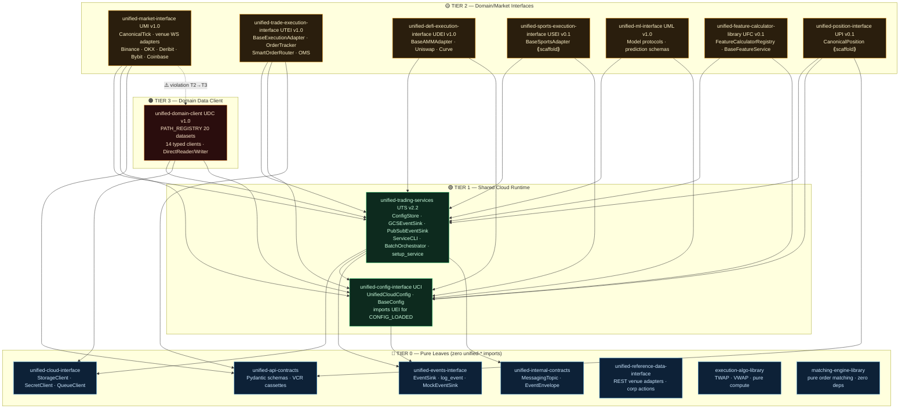

# Internal Dependency Graph — Unified Libraries

**Last Updated:** 2026-02-28 (full rewrite — previous version dated 2026-02-19 used obsolete pre-refactor library names)
**Purpose:** Show every internal unified-\* library dependency, library→library and service→library, for the current
T0–T3 architecture. **SSOT:**
[`unified-trading-pm/workspace-manifest.json`](../../../../unified-trading-pm/workspace-manifest.json) ·
[`LIBRARY-DEPENDENCY-MATRIX.md`](./LIBRARY-DEPENDENCY-MATRIX.md)

> **Version labels in this diagram are semantic milestone targets, not current semver.** For actual pinned versions, see
> `unified-trading-pm/workspace-manifest.json`.

> ⚠️ **Migration note:** The 2026-02-19 version of this doc referenced `unified-order-interface` (now renamed
> `unified-trade-execution-interface`) and `features-delta-two-service` (never existed). Both are corrected here.

---

## Library → Library Dependencies

All 16 unified-\* libraries. Arrows = "imports from". T0 libs have no arrows pointing outward (pure leaves).

---

## Service → Library Dependencies

All 17 services (14 active + 3 scaffolded future). Grouped by DAG layer.

```mermaid
graph TB
    subgraph Libs["Libraries (T0–T3)"]
        UTS2["UTS (T1)"]
        UMI2["UMI (T2)"]
        UTEI2["UTEI (T2)"]
        UDEI2["UDEI (T2)"]
        USEI2["USEI (T2) ⟪f⟫"]
        UML2["UML (T2)"]
        UFC2["UFC (T2)"]
        UPI2["UPI (T2) ⟪f⟫"]
        UDC2["UDC (T3)"]
        URDI2["URDI (T0)"]
        EAL2["EAL (T0)"]
        MEL2["MEL (T0)"]
        AC2["AC (T0)"]
    end

    subgraph L1["Layer 1 · Data Ingestion"]
        IS["instruments-service"]
        MTDH["market-tick-data-service"]
    end

    subgraph L2["Layer 2 · Market Data Processing"]
        MDPS["market-data-processing-service"]
    end

    subgraph L3["Layer 3 · Features"]
        FCS["features-calendar-service"]
        FDS["features-delta-one-service"]
        FVS["features-volatility-service"]
        FOS["features-onchain-service"]
        FSS["features-sports-service ⟪f⟫"]
    end

    subgraph L4["Layer 4 · ML"]
        MLTR["ml-training-service"]
        MLIN["ml-inference-service"]
    end

    subgraph L5["Layer 5 · Strategy & Execution"]
        STR["strategy-service"]
        EXEC["execution-service"]
    end

    subgraph L6["Layer 6 · Risk/PnL/Ops"]
        PNL["pnl-attribution-service"]
        PBM["position-balance-monitor-service"]
        RAE["risk-and-exposure-service"]
        ALT["alerting-service"]
    end

    %% Layer 1
    IS --> UTS2
    IS --> URDI2
    IS --> UMI2
    IS --> UDC2

    MTDH --> UTS2
    MTDH --> UMI2
    MTDH --> UDC2

    %% Layer 2
    MDPS --> UTS2
    MDPS --> UMI2
    MDPS --> UDC2

    %% Layer 3
    FCS --> UTS2
    FCS --> UFC2

    FDS --> UTS2
    FDS --> UMI2
    FDS --> UFC2
    FDS --> UDC2

    FVS --> UTS2
    FVS --> UMI2
    FVS --> UFC2
    FVS --> UDC2

    FOS --> UTS2
    FOS --> UDEI2
    FOS --> UFC2
    FOS --> UDC2

    FSS --> UTS2
    FSS --> USEI2
    FSS --> UFC2
    FSS --> UDC2

    %% Layer 4
    MLTR --> UTS2
    MLTR --> UML2
    MLTR --> UDC2

    MLIN --> UTS2
    MLIN --> UML2
    MLIN --> UDC2

    %% Layer 5
    STR --> UTS2
    STR --> UMI2
    STR --> UML2
    STR --> UDC2

    EXEC --> UTS2
    EXEC --> UMI2
    EXEC --> UTEI2
    EXEC --> EAL2
    EXEC --> MEL2
    EXEC --> AC2
    EXEC --> UDC2

    %% Layer 6
    PNL --> UTS2
    PNL --> UDC2

    PBM --> UTS2
    PBM --> UPI2
    PBM --> UDC2

    RAE --> UTS2
    RAE --> UDC2

    ALT --> UTS2

    SVS --> UTS2
    SVS --> UDC2
```

---

## Dependency Matrix (Tabular — All Services × All Libraries)

`●` = direct dependency · `○` = not required · `⟪f⟫` = future/scaffolded

| Service                          | UTS | UCI | UEI | UCLI | AC  | UIC | URDI | EAL | MEL | UMI | UTEI | UDEI | USEI | UML | UFC | UPI | UDC |
| -------------------------------- | :-: | :-: | :-: | :--: | :-: | :-: | :--: | :-: | :-: | :-: | :--: | :--: | :--: | :-: | :-: | :-: | :-: |
| instruments-service              |  ●  |  ●  |  ●  |  ○   |  ○  |  ○  |  ●   |  ○  |  ○  |  ●  |  ○   |  ○   |  ○   |  ○  |  ○  |  ○  |  ●  |
| market-tick-data-service         |  ●  |  ●  |  ●  |  ○   |  ○  |  ○  |  ○   |  ○  |  ○  |  ●  |  ○   |  ○   |  ○   |  ○  |  ○  |  ○  |  ●  |
| market-data-processing-service   |  ●  |  ●  |  ●  |  ○   |  ○  |  ○  |  ○   |  ○  |  ○  |  ●  |  ○   |  ○   |  ○   |  ○  |  ○  |  ○  |  ●  |
| features-calendar-service        |  ●  |  ●  |  ●  |  ○   |  ○  |  ○  |  ○   |  ○  |  ○  |  ○  |  ○   |  ○   |  ○   |  ○  |  ●  |  ○  |  ○  |
| features-delta-one-service       |  ●  |  ●  |  ●  |  ○   |  ○  |  ○  |  ○   |  ○  |  ○  |  ●  |  ○   |  ○   |  ○   |  ○  |  ●  |  ○  |  ●  |
| features-volatility-service      |  ●  |  ●  |  ●  |  ○   |  ○  |  ○  |  ○   |  ○  |  ○  |  ●  |  ○   |  ○   |  ○   |  ○  |  ●  |  ○  |  ●  |
| features-onchain-service         |  ●  |  ●  |  ●  |  ○   |  ○  |  ○  |  ○   |  ○  |  ○  |  ○  |  ○   |  ●   |  ○   |  ○  |  ●  |  ○  |  ●  |
| features-sports-service ⟪f⟫      |  ●  |  ●  |  ●  |  ○   |  ○  |  ○  |  ○   |  ○  |  ○  |  ○  |  ○   |  ○   |  ●   |  ○  |  ●  |  ○  |  ●  |
| ml-training-service              |  ●  |  ●  |  ●  |  ○   |  ○  |  ○  |  ○   |  ○  |  ○  |  ○  |  ○   |  ○   |  ○   |  ●  |  ○  |  ○  |  ●  |
| ml-inference-service             |  ●  |  ●  |  ●  |  ○   |  ○  |  ○  |  ○   |  ○  |  ○  |  ○  |  ○   |  ○   |  ○   |  ●  |  ○  |  ○  |  ●  |
| strategy-service                 |  ●  |  ●  |  ●  |  ○   |  ○  |  ○  |  ○   |  ○  |  ○  |  ●  |  ○   |  ○   |  ○   |  ●  |  ○  |  ○  |  ●  |
| execution-service                |  ●  |  ●  |  ●  |  ○   |  ●  |  ○  |  ○   |  ●  |  ●  |  ●  |  ●   |  ○   |  ○   |  ○  |  ○  |  ○  |  ●  |
| pnl-attribution-service          |  ●  |  ●  |  ●  |  ○   |  ○  |  ○  |  ○   |  ○  |  ○  |  ○  |  ○   |  ○   |  ○   |  ○  |  ○  |  ○  |  ●  |
| position-balance-monitor-service |  ●  |  ●  |  ●  |  ○   |  ○  |  ○  |  ○   |  ○  |  ○  |  ○  |  ○   |  ○   |  ○   |  ○  |  ○  |  ●  |  ●  |
| risk-and-exposure-service        |  ●  |  ●  |  ●  |  ○   |  ○  |  ○  |  ○   |  ○  |  ○  |  ○  |  ○   |  ○   |  ○   |  ○  |  ○  |  ○  |  ●  |
| alerting-service                 |  ●  |  ●  |  ●  |  ○   |  ○  |  ○  |  ○   |  ○  |  ○  |  ○  |  ○   |  ○   |  ○   |  ○  |  ○  |  ○  |  ○  |

---

## pyproject.toml Reality Check (verified 2026-02-28)

Service pyproject.toml files should declare all direct dependencies explicitly. Known gaps from prior audit (2026-02-19,
still unresolved):

| Service                  | Gap                                                                        | Status              |
| ------------------------ | -------------------------------------------------------------------------- | ------------------- |
| execution-service        | `execution-algo-library` used but not in pyproject.toml                    | ⚠️ pending          |
| market-tick-data-service | `unified-market-interface` used but relied on transitive install           | ⚠️ pending          |
| All services             | UCI, UEI often not explicitly declared — rely on UTS transitive re-exports | ⚠️ accepted pattern |

**Rule:** All direct `from unified_X import ...` calls must have `unified-X` in pyproject.toml `dependencies`.
Transitive-only is acceptable only for UCLI and UIC_INT (which services never import directly; only UTS does).

---

## Known Violations Requiring Resolution

| Violation                                                                 | Location                           | Task ID                          | Priority |
| ------------------------------------------------------------------------- | ---------------------------------- | -------------------------------- | -------- |
| T2→T3 import: UMI imports UDC                                             | `unified-market-interface/` source | `cohesion-umi-udc-dep-violation` | P1       |
| MEL tier mismatch: DAG shows as T2 but T0 behavior                        | DAG SVG visual                     | `dag-mel-tier-mismatch`          | P1       |
| Non-canonical venue names: "binance" (lowercase) in 100+ production files | multiple services                  | `venue-name-canonicalization`    | P1       |

---

## Transitive T0 Coverage

Every service gets these T0 libs transitively through UTS — no direct import needed:

- `unified-cloud-interface` (UCLI) — via `UTS → UCLI`
- `unified-internal-contracts` (UIC_INT) — via `UTS → UIC_INT`

Services that use `log_event` or `setup_events` directly should import `unified-events-interface` (UEI) explicitly, even
though it's also re-exported by UTS.

---

---

## Deployment Split (unified-trading-deployment-v3 ARCHIVED 2026-03-03)

UTD V3 was split into 4 repos. The library dependencies for the new repos:

| New Repo                   | Tier        | Deps                                                     |
| -------------------------- | ----------- | -------------------------------------------------------- |
| `deployment-service`       | T5          | UTS, UCLI, UCI, UDC                                      |
| `deployment-api`           | T5          | UCI, UEI (no deployment-service dep in code)             |
| `deployment-ui`            | UI          | (no Python deps — React calling deployment-api via HTTP) |
| `system-integration-tests` | integration | (no Python service deps — HTTP/GCS/PubSub only)          |

`deployment-service` owns the Python orchestrator, CLI, backends, Terraform, and configs. `deployment-api` is a
standalone FastAPI service (monitors deployments, service status, Cloud Build); it does **not** import
`deployment-service` in code — they are independent. `system-integration-tests` sits above all tiers — zero Python
imports from any service or library.

See task `deployment-v3-four-way-split` and SSOT `06-coding-standards/integration-testing-layers.md`.

---

## Integration Testing Layers

4 layers validate the system. Layers are cumulative. SSOT:
[`06-coding-standards/integration-testing-layers.md`](../../06-coding-standards/integration-testing-layers.md)

| Layer | Purpose                                     | Location                 | In quickmerge?   |
| ----- | ------------------------------------------- | ------------------------ | ---------------- |
| 0     | Contract alignment (AC↔UIC schema pairs)   | AC + UIC tests/          | Yes              |
| 1     | Schema robustness (fail-fast, corner cases) | Each repo tests/         | Yes              |
| 2     | Infra verify (buckets, topics, IAM)         | deployment-service       | No (post-deploy) |
| 3a    | Pipeline smoke (fast, happy path)           | system-integration-tests | No (post-deploy) |
| 3b    | Full E2E (corner cases, auth, perf)         | system-integration-tests | No (post-deploy) |

---

## References

- **Tier architecture SSOT:** [`04-architecture/TIER-ARCHITECTURE.md`](../../04-architecture/TIER-ARCHITECTURE.md)
- **Library quick-reference:** [`LIBRARY-DEPENDENCY-MATRIX.md`](./LIBRARY-DEPENDENCY-MATRIX.md)
- **Machine-readable manifest:**
  [`unified-trading-pm/workspace-manifest.json`](../../../../unified-trading-pm/workspace-manifest.json)
- **QG tier enforcement:** [`06-coding-standards/quality-gates.md`](../../06-coding-standards/quality-gates.md)
- **Topology DAG:** [`04-architecture/TOPOLOGY-DAG.md`](../../04-architecture/TOPOLOGY-DAG.md)
- **Integration testing layers:**
  [`06-coding-standards/integration-testing-layers.md`](../../06-coding-standards/integration-testing-layers.md)
