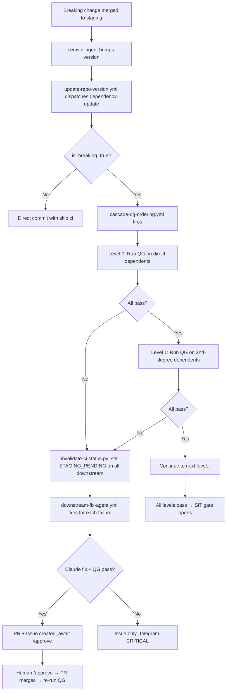

# Dependency Cascade

**SSOT:** `unified-trading-pm/.github/workflows/cascade-qg-ordering.yml` (orchestrator),
`unified-trading-pm/scripts/cascade/invalidate-ci-status.py` (invalidation),
`unified-trading-pm/.github/workflows/downstream-fix-agent.yml` (auto-fix)

---

## Overview

When a breaking change lands on staging, the dependency cascade ensures all affected downstream repos are validated,
fixed if possible, and promoted — or explicitly invalidated if they can't be fixed automatically.

The cascade is **topological**: it processes repos in dependency order (T0 → T1 → T2 → T3 → services → UIs), failing
fast when a tier has failures.

## Cascade Flow



## Topological Fail-Fast Algorithm

1. Read `topologicalOrder.levels` from workspace-manifest.json
2. Find all repos that transitively depend on the changed repo
3. Group affected repos by their topological level
4. For each level (ascending):
   - Dispatch QG to all repos in the level (parallel within level)
   - Wait for completion (poll ci_status, 15min timeout per level)
   - If ANY repo fails: invalidate all subsequent levels → exit
   - If all pass: proceed to next level
5. All levels pass → SIT gate opens

### PM Special Case

PM and codex are "universal dependencies" — everything depends on them. When PM/codex has a breaking change:

- Run QG tier-by-tier: T0 (parallel) → T1 (parallel) → T2 → T3 → services → UIs
- Stop at first tier with any failure
- This is the same algorithm but with all repos as affected

## ci_status Invalidation

When a repo fails QG after a breaking update, `invalidate-ci-status.py` walks the manifest DAG forward from the failed
repo and sets all transitive dependents to `STAGING_PENDING`. This prevents stale green status on repos that haven't
been tested against the breaking change.

```
Failed repo X
  → X's direct dependents: set STAGING_PENDING
    → Their dependents: set STAGING_PENDING
      → ... (full transitive closure)
```

Uses `fcntl.flock` on `.workspace-manifest.lock` for safe concurrent writes.

## Autonomous Fix Agent

When a downstream repo's QG fails after a breaking dependency update:

1. Clone: target repo + breaking repo + PM + codex
2. Inject mandatory rules via `inject-mandatory-rules.sh`
3. Build prompt: breaking repo diff + QG failure output + target repo imports
4. Claude fixes code (renamed imports, removed APIs, changed signatures)
5. Validate: files exist, no merge markers, Python/TS syntax valid
6. Run QG (advisory)
7. If QG passes: PR + Issue + Telegram ("approve to merge")
8. If QG fails: Issue only + Telegram CRITICAL ("needs human")

**Agent NEVER self-merges.** Human comments `/approve` on the Issue.

### Approval Timeout Escalation

- 4h without `/approve`: Telegram WARNING
- 24h without `/approve`: Telegram CRITICAL
- For crypto 24/7: prevents fixes from sitting unreviewed while markets are live

### Auto-Merge Path (Non-Breaking Only)

For non-breaking dependency updates (is_breaking=false) where:

- QG passes
- SIT validates
- Repo is at 1.0.0+ (pre-1.0.0 always requires human approval)

The PR auto-merges without human intervention. MAJOR/breaking fixes always require `/approve`.

## Breaking Change Detection (Pre-1.0.0)

All repos are <1.0.0. Per semver, `feat!:` bumps MINOR (not MAJOR). The `is_breaking` flag in the dispatch payload
distinguishes breaking MINORs from non-breaking features:

| Commit Type         | Pre-1.0.0 Bump | is_breaking | Route                                 |
| ------------------- | -------------- | ----------- | ------------------------------------- |
| `fix:`              | PATCH          | false       | Direct commit, [skip ci]              |
| `feat:`             | MINOR          | false       | Direct commit, [skip ci]              |
| `feat!:`            | MINOR          | true        | PR path, staging lock, QG forced      |
| Post-1.0.0 `feat!:` | MAJOR          | true        | PR path, staging lock, approval issue |

## Dependency Caps

Repos can pin to old versions while fixing code:

```json
"dependency_caps": {
  "unified-market-interface": "<0.3.0"
}
```

When a capped repo receives a breaking update, the constraint update is skipped. `run-version-alignment.sh` flags capped
repos as "pinned to old version — update needed."

## Reverse Dependency Sync

When T0 libraries (UAC, UIC, UEI, UCI, UTL, URDI) change schemas:

1. semver-agent dispatches `schema-changed` to PM
2. PM `schema-changed-handler.yml` clones the changed repo, reads the diff
3. Checks if cursor-rules or codex docs reference changed symbols
4. If yes: dispatches to rules-alignment-agent and codex-sync-agent
5. Agents update docs/rules to match new schema

This ensures documentation stays in sync with code without requiring PM/codex to be listed as formal dependents.

## Key Files

| File                                      | Purpose                           |
| ----------------------------------------- | --------------------------------- |
| `cascade-qg-ordering.yml`                 | Topological QG orchestrator       |
| `scripts/cascade/invalidate-ci-status.py` | Transitive ci_status invalidation |
| `downstream-fix-agent.yml`                | Claude-powered auto-fix           |
| `fix-approval-timeout.yml`                | 4h/24h escalation                 |
| `auto-merge-minor-fixes.yml`              | Non-breaking auto-merge           |
| `schema-changed-handler.yml`              | Reverse dep sync trigger          |
| `update-repo-version.yml`                 | Version cascade dispatcher        |
| `update-dependency-version.yml`           | Per-repo dep constraint updater   |
