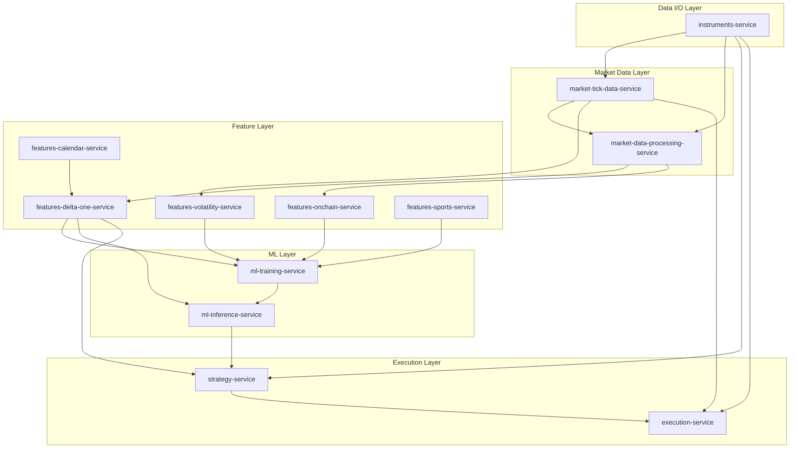

# Unified Trading Codex

The governing principles for the Unified Trading System. This repository is the single source of truth: if the code
disagrees with the codex, either the code or the codex needs updating.

## What Is the Codex?

"Codex" means a systematic collection of laws, rules, and principles. This repo documents how every service, mode
(batch/live), asset class, and client deployment should behave in the Unified Trading System.

## How to Navigate

Every directory follows the same pattern: `README.md` (universal) -> `batch/` (batch-specific) -> `live/`
(live-specific) -> `per-service/` (service-specific deviations). Read top-down: the README is always true, batch/live
extends it, per-service captures what is unique.

**SSOT:** See [`00-SSOT-INDEX.md`](./00-SSOT-INDEX.md) for the master map of canonical data sources.

### Directory Map

| Directory                | One-line description                                                                     |
| ------------------------ | ---------------------------------------------------------------------------------------- |
| `00-SSOT-INDEX.md`       | Master data source index — where every piece of information lives                        |
| `01-domain/`             | Business domain: instruments, asset classes, signal-based strategies, client model       |
| `02-data/`               | Data schemas, subscription/publishing model, partitioning, data quality                  |
| `03-observability/`      | 3-tier event logging (lifecycle + resource + domain), alerting, monitoring               |
| `04-architecture/`       | Batch-live symmetry, deployment topology, concurrency, pipeline DAG                      |
| `05-infrastructure/`     | Cloud-agnostic abstractions, unified libraries, CI/CD, Terraform, Docker                 |
| `06-coding-standards/`   | Quality gates, testing, contribution workflow, dependency management                     |
| `07-security/`           | Secrets management, API keys, permissions, dependency scanning                           |
| `07-services/`           | Per-service documentation and specifications                                             |
| `08-workflows/`          | Disaster recovery, client lifecycle, incident response, reconciliation                   |
| `09-analysis/`           | Backtest metrics, live performance, cost analysis                                        |
| `10-audit/`              | Codex compliance checklists (canonical, 100+ items per service across 9 principle areas) |
| `11-project-management/` | Issue tracking, roadmaps (batch/live production), priority matrix, milestones            |
| `12-agent-workflow/`     | AI agent workflow guides, task templates, sub-agent patterns                             |
| `13-presentations/`      | Pitch decks and external presentations                                                   |
| `14-testing-guides/`     | Testing standards, smoke tests, UI testing guides                                        |

### Start Here

| Goal                  | Read                                                                                       |
| --------------------- | ------------------------------------------------------------------------------------------ |
| New service developer | `04-architecture/README.md` → `06-coding-standards/README.md` → service's per-service docs |
| AI agent              | `.cursorrules` → `.cursor/rules/*.mdc` → `00-SSOT-INDEX.md` for canonical source lookups   |
| Code reviewer         | `10-audit/` checklists for compliance verification                                         |
| Ops / infra engineer  | `deployment-service/configs/` → `05-infrastructure/` → `00-SSOT-INDEX.md`                  |

## The System at a Glance

- **13 service repos** total; **11 pipeline services**: instruments -> market-tick-data-service ->
  market-data-processing -> features-calendar -> features-delta-one, features-volatility, features-onchain ->
  ml-training -> ml-inference -> strategy -> execution-service _(corporate-actions decommissioned 2026-02-10 — see
  `10-audit/live/corporate-actions.yaml`)_
- **1 shared library**: unified-trading-library
- **4 deployment repos**: deployment-service (orchestration + configs + terraform), deployment-api (FastAPI),
  deployment-ui (React), system-integration-tests (Layer 3a/3b)
- **Asset classes**: equities, crypto (CeFi), DeFi, CFDs, options, futures, sports betting
- **Canonical categories**: CeFi, TradFi, DeFi, Sports
- **Cloud**: GCP primary, AWS secondary
- **Latency**: Signal-based strategies with <2s end-to-end latency target

## Pipeline DAG



## Design Philosophy

- Abstract the commonalities, document the deviations
- Batch and live should be as similar as possible
- Services should be as similar as possible
- Asset class, instrument, strategy, and exchange should be as agnostic as possible
- Document what is genuinely different

## How to Use This Repo

| Goal                   | Read                                                                                                                                                                             |
| ---------------------- | -------------------------------------------------------------------------------------------------------------------------------------------------------------------------------- |
| Building a new service | `01-domain/`, `04-architecture/`, `06-coding-standards/`, then service's per-service docs in `07-services/`. **Checklist:** `deployment-service/configs/checklist.template.yaml` |
| Contributing code      | `06-coding-standards/contribution-guide.md`                                                                                                                                      |
| Debugging production   | `03-observability/`, `08-workflows/incident-response.md`                                                                                                                         |
| Onboarding a client    | `08-workflows/client-lifecycle.md`                                                                                                                                               |
| Assessing readiness    | `10-audit/`                                                                                                                                                                      |
| Finding canonical SSOT | [`00-SSOT-INDEX.md`](./00-SSOT-INDEX.md)                                                                                                                                         |

## Development Setup

This repository uses pre-commit hooks to ensure consistent formatting and quality of documentation.

### Quick Setup

```bash
# Install and setup pre-commit hooks
./scripts/setup-pre-commit.sh
```

### What Gets Checked

- **Prettier**: Formats markdown, YAML, and JSON files
- **Ruff**: Lints and formats Python scripts
- **Basic checks**: Trailing whitespace, end-of-file fixers, YAML/TOML validation

See [`.github/PRE_COMMIT_SETUP.md`](.github/PRE_COMMIT_SETUP.md) for detailed setup instructions.

## Relationship to Code

- This repo documents **how things should be**
- The code repos implement **what is**
- The audit (10-audit/) tracks the gap
- Goal: close the gap to 100% compliance for production readiness

<!-- quickmerge pipeline test 2025-03-13 -->
