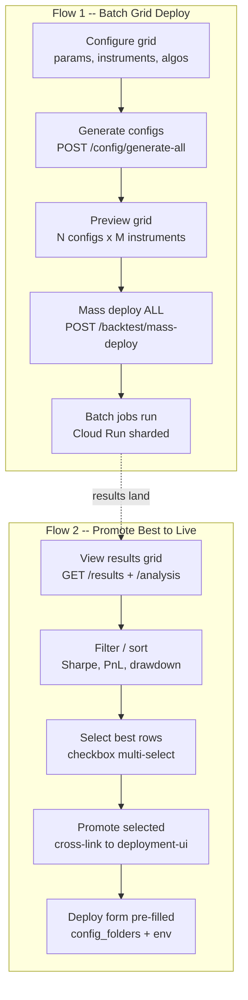

# Config Lifecycle Flows -- Grid Deploy and Promote Best

Two distinct flows share the same `DimensionalGrid` + `FilterBar` infrastructure but serve different purposes:



---

## Flow 1: Generate Grid Configs and Mass Deploy (Batch Side)

### What exists

- [strategy-ui/src/pages/StrategyConfigGenerator.tsx](strategy-ui/src/pages/StrategyConfigGenerator.tsx): Mock-only grid
  param editor. Generates fake config IDs client-side.
- [execution-results-api/.../routes/config.py](execution-results-api/execution_results_api/api/routes/config.py):
  `POST /config/generate-all` defined but returns 501. Schemas (`GenerateAllRequest`, `GenerateAllResponse`) are
  complete.
- [execution-results-api/.../routes/backtest.py](execution-results-api/execution_results_api/api/routes/backtest.py):
  `POST /backtest/mass-deploy` works -- calls UTD-v2 CLI with `config_folders`, `start_date`, `end_date`, `force`,
  `dry_run`.

### What to build

**A. Wire `StrategyConfigGenerator` to real API**

Replace mock generation with:

1. `GET /config/algorithms` -- populate algo selector with real parameter grids
2. `GET /config/strategies` -- populate strategy selector (filtered by mode/timeframe)
3. `POST /config/generate-all` -- generate configs server-side, get back `total_configs`, `gcs_paths`, breakdown by
   category/mode/timeframe/algorithm

**B. Add "Preview and Deploy" step after generation**

After generation returns, show a summary card:

- Total configs generated (e.g., "1,248 configs across 12 instruments")
- Breakdown by dimension (category: 4 CEFI, 8 DEFI; mode: SCE/HUF; timeframe: 5M/15M)
- GCS paths where configs were written
- Date range picker (start/end for batch run)
- Dry run toggle (default on)
- **"Mass Deploy All"** button -- calls `POST /backtest/mass-deploy` with `config_folders` from generation response

**C. Progress tracking**

After mass deploy returns `deployment_id`:

- Poll `GET /backtest/status/{deployment_id}` for progress
- Show progress bar with shard completion count
- Link to deployment-ui for full deployment details

### Backend prerequisite

The `POST /config/generate-all` endpoint currently returns 501 because grid_generator was extracted. Two options (decide
during implementation):

- Wire HTTP call to execution-service's grid generation endpoint
- Extract `grid_generator` into `execution-algo-library` (shared library)

This is a backend dependency that must be resolved before the UI can use real data. If blocked, the UI can be built
against the existing mock-api pattern and switched when the backend is ready.

---

## Flow 2: Review Results, Select Best, Promote to Live

### What exists

- [strategy-ui/src/pages/StrategyGridResults.tsx](strategy-ui/src/pages/StrategyGridResults.tsx): Static mock table (8
  rows), no selection, no actions, no API calls.
- [execution-results-api/.../routes/backtest.py](execution-results-api/execution_results_api/api/routes/backtest.py):
  `GET /backtest/results` returns results list.
- [deployment-ui/src/components/DeployForm.tsx](deployment-ui/src/components/DeployForm.tsx): Full deploy form with
  dimension selection, `CloudConfigBrowser` for GCS paths. No query param pre-filling.

### What to build

**A. Replace `StrategyGridResults` with `DimensionalGrid`**

The `DimensionalGrid` component (from the ui-kit plan) replaces the static table:

- **Dimensions**: instrument, strategy_type, algo, timeframe, mode, category
- **Metrics**: Sharpe, net PnL (bps), total trades, max drawdown, win rate, avg hold time
- **Data source**: `GET /backtest/results` (with filters as query params)
- **Sorting**: Click column header to sort; default: Sharpe descending
- **Heatmap**: Optional heatmap mode for Sharpe or PnL across instrument x algo matrix

**B. Row selection + promote toolbar**

Add to `DimensionalGrid`:

- Checkbox column (first column) for multi-select
- "Select all visible" / "Deselect all" in header
- Floating toolbar appears when rows selected:
  - Selected count badge: "12 configs selected"
  - **"Promote to Batch Deploy"** button -- for deploying selected configs as new batch run
  - **"Promote to Live"** button -- for deploying selected configs to live environment
  - Environment picker dropdown (dev / staging / live)

**C. Cross-link to `deployment-ui` with pre-filled config**

When "Promote to Live" is clicked:

1. Collect `config_gcs_path` from each selected row
2. Build cross-link URL:

```
http://localhost:5173/deploy?service=strategy-service&config_folders=gs://...path1,gs://...path2&env=staging&mode=live
```

1. Open in new tab (or same window with back-link)

**D. `deployment-ui` accepts query params on DeployForm**

Update `DeployForm` and the `deployment-ui` router to accept inbound cross-link:

- `?service=strategy-service` -- pre-select service in ServiceList
- `?config_folders=gs://...,gs://...` -- pre-fill CloudConfigBrowser path (or bypass browser and show selected paths
  directly)
- `?env=staging` -- pre-select environment
- `?mode=batch|live` -- pre-select deploy mode
- Show a banner: "Pre-filled from Strategy UI -- 12 configs selected"
- User reviews and clicks Deploy (no auto-deploy)

---

## ML Training Equivalent

Same two-flow pattern:

### Flow 1 (ML): Configure training run and deploy

- [ml-training-ui/src/pages/ExperimentsPage.tsx](ml-training-ui/src/pages/ExperimentsPage.tsx): Currently mock. Wire to
  `GET /experiments` from `ml-training-api`.
- After training completes, results grid shows model metrics (accuracy, loss, F1, Sharpe improvement).

### Flow 2 (ML): Select best model and deploy to inference

- Wire `ExperimentDetailPage` to real `GET /experiments/:runId` from `ml-training-api`
- Add model comparison grid with sortable metrics
- "Deploy to Inference" button -- calls `POST /models/deploy` on `ml-inference-api` inline (not cross-link; deployment
  is a single API call)
- For full service deploy (new ml-inference-service version), cross-link to
  `deployment-ui/deploy?service=ml-inference-service`
- Wire the existing unrouted `DeployModal` component into the experiment detail flow

---

## Shared Infrastructure (from ui-kit plan)

These components serve both flows and were scoped in the prior plan:

- `**DimensionalGrid`\*\*: Sortable metrics, dimension pills, row selection with checkbox, CSV export, heatmap toggle.
  Add: selection toolbar with promote actions.
- `**FilterBar`\*\*: URL-based state, cascading counts, multi-select. Used to filter the results grid by instrument,
  strategy, timeframe, algo.
- `**CrossLink` / `buildCrossLink`\*\*: Generate URLs between surfaces. Used by promote buttons.
- `**SurfaceRegistry`\*\*: Port/route mapping. Used to build deployment-ui cross-links.

---

## Implementation Order

Phase 1 focuses on the promote flow (Flow 2) because it doesn't depend on the 501 grid_generator backend:

1. **DimensionalGrid with selection** -- ui-kit component (extends prior plan's `dimensional-grid-component` todo)
2. **Wire StrategyGridResults to DimensionalGrid** -- strategy-ui, using mock-api initially
3. **Add promote toolbar** -- strategy-ui, builds cross-link URLs
4. **deployment-ui query param acceptance** -- read params, pre-fill DeployForm
5. **ML Training model deploy** -- wire ExperimentDetailPage + DeployModal

Phase 2 adds the generation flow (Flow 1) once the grid_generator backend is resolved:

1. **Wire StrategyConfigGenerator to API** -- strategy-ui, real endpoints
2. **Add mass-deploy step** -- strategy-ui, calls `/backtest/mass-deploy`
3. **Progress tracking** -- strategy-ui, polls job status

---

## Files to modify

**unified-trading-ui-kit:**

- `src/components/ui/dimensional-grid.tsx` (new) -- core grid with selection
- `src/components/ui/selection-toolbar.tsx` (new) -- floating toolbar for promote actions
- `src/lib/surface-registry.ts` (new) -- cross-link URL builder

**strategy-ui:**

- `src/pages/StrategyGridResults.tsx` -- replace static table with DimensionalGrid
- `src/pages/StrategyConfigGenerator.tsx` -- wire to real API + add mass-deploy step
- `src/api/` -- add/update API client calls for config + backtest endpoints

**deployment-ui:**

- `src/App.tsx` -- add route awareness for query params
- `src/components/DeployForm.tsx` -- accept and pre-fill from query params
- `src/components/PrefilledBanner.tsx` (new) -- banner showing cross-link source

**ml-training-ui:**

- `src/App.tsx` -- route `ExperimentDetail` (currently unrouted) into the router
- `src/pages/ExperimentDetailPage.tsx` -- wire to real API + integrate DeployModal
- `src/pages/ModelsPage.tsx` -- wire to real API, add deploy action
