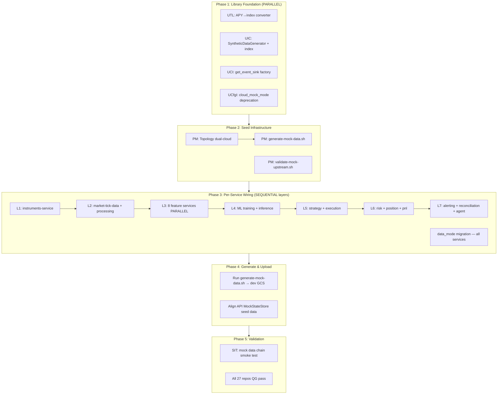

# Mock Data Rollout — Context & Architecture

## Execution DAG (Dependency Graph)

## Key Design Decisions

1. **Mock in yield space, consume in index space**: SyntheticDataGenerator produces APY via OU mean reversion (easier to
   model), then UTL's `apy_to_cumulative_index()` converts to cumulative indices for downstream consumption. Services
   never see raw APY — they get index columns in their candle/feature data.

2. **Real instruments preferred, mock as starting point**: instruments-service seed uses real instrument lists (top 50
   crypto, S&P 100, major DeFi pools) where available. Synthetic prices are generated against real instrument IDs. When
   live reference data pipeline is ready, just repoint seed source — no code change.

3. **Seed scripts live in services, orchestration in PM**: Each service owns `scripts/seed_mock_data.py` (knows its
   domain). PM owns `scripts/dev/generate-mock-data.sh` (knows the dependency order from runtime-topology.yaml).

4. **1-year of data, normal scenario, seed=42**: Deterministic and reproducible. `seed_spec.yaml` already defines 100+
   instruments with calibrated GBM parameters. Volume profiles use hour-of-day weighting. Cross-asset correlations
   preserved (BTC-ETH: 0.85).

5. **Upstream validation before seeding**: Each layer validates its upstream mock data exists before running. Fail-fast:
   if instruments seed is missing, don't attempt market data generation.

6. **APIs already done, workers need seed data**: 10 HTTP APIs have MockStateStore (complete). 21 worker services need
   `scripts/seed_mock_data.py` (generates Parquet for their domain). Workers don't need MockStateStore — they need mock
   INPUT data at their DependencyChecker path templates.

7. **Oracle data is not a standalone service**: It's `DefiOracleAdapter` inside market-data-processing-service. Oracle
   mock data (mark_price, liquidity_index, borrow_index) is generated in Layer 2 as part of market-data-processing seed.

## Pre-Audit Manifest

### Symbols being added (new exports)

| Symbol                      | Repo | File                   | Consumers                                                                                                   |
| --------------------------- | ---- | ---------------------- | ----------------------------------------------------------------------------------------------------------- |
| `apy_to_cumulative_index()` | UTL  | `core/index_utils.py`  | UIC SyntheticDataGenerator, features-onchain, strategy-service settlement, all DeFi seed scripts            |
| `staking_rate_to_index()`   | UTL  | `core/index_utils.py`  | UIC SyntheticDataGenerator, features-onchain LST calculator, strategy-service LST settlement                |
| `get_event_sink()`          | UCI  | `factory.py`           | execution-service, strategy-service, market-tick-data-service (Phase 1); all other services (OOS follow-up) |
| `generate_staking_rates()`  | UIC  | `testing/synthetic.py` | Seed scripts for features-onchain, strategy-service DeFi settlement tests                                   |

### Symbols being deprecated (not removed)

| Symbol                     | Repo  | File              | Action                                                                          |
| -------------------------- | ----- | ----------------- | ------------------------------------------------------------------------------- |
| `cloud_mock_mode` property | UCfgI | `cloud_config.py` | Add DeprecationWarning; keep bridge; services migrate to `data_mode` in Phase 3 |

### Services checked for mock readiness (audit 2026-03-18)

All 31 services:

- 31/31 use UnifiedCloudConfig (no os.getenv for mock mode)
- 31/31 reference CLOUD_MOCK_MODE in config
- 10/31 have MockStateStore (all HTTP APIs — complete)
- 21/31 need seed data scripts (worker services — this plan)
- 0/31 have hardcoded mock data or fraudulent implementations
- 0/31 use direct cloud SDK in production paths (except deployment-service — approved exception)

### Cloud-agnosticism audit (2026-03-18)

| Component                                          | Status                    | Gap                                            |
| -------------------------------------------------- | ------------------------- | ---------------------------------------------- |
| UCI factory (get_storage_client, get_queue_client) | Cloud-agnostic            | None                                           |
| UTL DependencyChecker                              | Cloud-agnostic (uses UCI) | Property named gcs_client (legacy naming only) |
| Event sinks (UTL)                                  | Both GCP+AWS implemented  | No auto-select factory (fixed in p1-uci-sink)  |
| Runtime topology YAML                              | GCP-only                  | Fixed in p2-topology-dual-cloud                |
| Service bootstrap                                  | Mostly agnostic           | Some GCP fallback defaults (OOS fix)           |

### DeFi index vs APY audit (2026-03-18)

- Strategy-service settlement: correctly uses index-based P&L (liquidity_index, variableBorrowIndex growth)
- LST staking: uses weETH/ETH rate appreciation (rate proxy, not true index)
- SyntheticDataGenerator: generates raw APY only — NO index output (fixed in p1-uic-synth)
- features-onchain: uses simplified APY→index proxy (1.0 + apy/100) — should use cumulative index
- No shared APY→index converter exists (added in p1-utl-apy-index)

## Success Criteria

### Phase 1

- UTL: `apy_to_cumulative_index()` and `staking_rate_to_index()` exist with ≥95% test coverage
- UIC: `generate_defi_yields()` returns both APY and index columns; `generate_staking_rates()` exists
- UCI: `get_event_sink()` factory exists, tested for all 6 provider×mode combinations
- UCfgI: `cloud_mock_mode` access emits DeprecationWarning; `data_mode` documented as canonical
- All 4 library QGs pass

### Phase 2

- `generate-mock-data.sh` exists and runs end-to-end (even if services don't have seed scripts yet — it should
  gracefully report "no seed script" per service)
- `validate-mock-upstream.sh` exists and correctly identifies missing upstream data
- Runtime topology YAML has dual-cloud transport options
- PM QG passes

### Phase 3

- All 21 worker services have `scripts/seed_mock_data.py`
- Each seed script generates domain-appropriate Parquet at DependencyChecker path templates
- All services use `data_mode` instead of `cloud_mock_mode`
- Per-layer QG pass (run after each layer completes)

### Phase 4

- Full dependency chain runs without failures
- 1-year Parquet data at expected GCS/emulator paths for all services
- API MockStateStore seed data uses same instrument IDs as generated Parquet

### Phase 5

- SIT mock data chain smoke test passes
- All 27 affected repo QGs pass
- No pre-existing failures introduced as regressions

## Related Plans

- `production_mock_e2e_plan_d90c8f20` — E2E testability (VCR, mock replay, CI hermeticity). Complementary, not
  overlapping. That plan = test-time mocking. This plan = runtime mock data generation.
- `instruments_service_batch_validation_2026_03_17` — instruments-service architecture fix. Our p3-L1-instruments
  depends on the ConfigReloader + topology-driven transport patterns from that plan.
- `live_batch_alignment_audit_2026_03_18` — live/batch parity remediation. Our event sink factory (p1-uci-sink) aligns
  with that plan's event sink fixes.
- `defi_operation_capability_and_pipeline_2026_03_17` — DeFi pipeline. Our APY→index converter (p1-utl-apy-index)
  directly supports that plan's DeFi settlement calculations.
