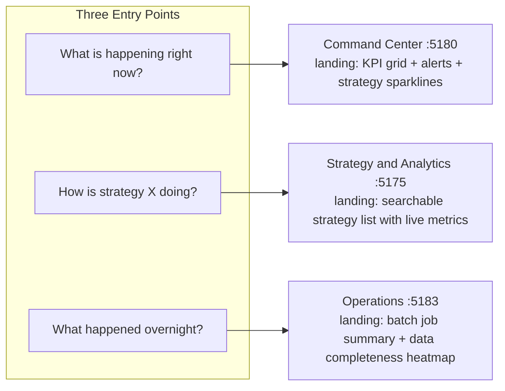

# UI Navigation and UX Model (Addendum to Data-Driven Consolidation Plan)

This refines the data-driven consolidation plan with UX specifics: intent-based navigation, the DimensionalGrid
component, and how config exploration works per surface.

## Three Fast Entry Points

Every session starts with one of three questions. The GlobalNavBar makes all three one click away, but the **landing
page** of each surface is optimized for its question:



### Command Center landing (`/`)

- Top row: 6 KPI cards (Total AUM, Daily PnL, Fund Sharpe, Max Drawdown, Active Strategies, Open Alerts)
- Middle: Strategy performance table with sparklines (sortable by PnL, Sharpe, drawdown -- each row is a CrossLink to
  strategy-ui)
- Bottom: Alert feed (last 10 alerts, severity-colored) + system health bar (green/amber/red per service tier)
- Everything clickable: strategy name -> strategy-ui, client name -> `/pnl/client/:id`, alert -> `/alerts`, health ->
  `/health`

### Strategy and Analytics landing (`/`)

- Search bar (prominent, top center): fuzzy search across all strategy names, instrument symbols, config IDs
- Filterable card grid: one card per strategy with type badge (DeFi/CeFi/TradFi/Sports), status pill
  (live/backtest/paper), key metrics (Sharpe, daily PnL, drawdown), mini equity curve sparkline
- Filter bar above: strategy type, client, status, asset class, venue -- all as dropdowns with counts
- Cards click through to `/strategies/:id` which is the hub for everything about that strategy

### Operations landing (`/`)

- Split view: left = batch job summary (last 24h: completed/failed/running counts), right = data completeness heatmap
  (services x dates)
- Below: recent deployments table + recent alerts from batch services
- Quick links: "Deploy a service", "View all logs", "Check compliance"

---

## Intent Navigation Map -- "I want to X, where do I go?"

### High-level overviews (summary of many things)

| I want to see...         | Surface        | Page       | What I see                           |
| ------------------------ | -------------- | ---------- | ------------------------------------ |
| Fund-level PnL           | Command Center | `/`        | KPI cards with total PnL             |
| All strategy performance | Command Center | `/`        | Strategy table with sparklines       |
| System health            | Command Center | `/health`  | Service grid + DAG                   |
| Batch run summary        | Operations     | `/`        | Job counts + completeness heatmap    |
| All clients              | Onboarding     | `/clients` | Client grid with AUM, strategy count |
| All pending settlements  | Settlement     | `/`        | Settlement dashboard                 |

### Deep dives (drill into one thing)

| I want to drill into...          | Surface        | Page                        | How I get there                 |
| -------------------------------- | -------------- | --------------------------- | ------------------------------- |
| One strategy's PnL decomposition | Strategy UI    | `/strategies/:id/analytics` | Click strategy name anywhere    |
| One strategy's execution quality | Strategy UI    | `/strategies/:id/execution` | Click strategy -> Execution tab |
| One strategy's live state        | Strategy UI    | `/strategies/:id/live`      | Click strategy -> Live tab      |
| One client's PnL by strategy     | Command Center | `/pnl/client/:id`           | Click client name anywhere      |
| One instrument's tick data       | Strategy UI    | `/instruments?q=:symbol`    | Click instrument name anywhere  |
| One service's deploy history     | Operations     | `/services/:name`           | Click service name anywhere     |
| One recon run's deviations       | Command Center | `/recon/:date/deviations`   | Click recon run row             |
| One batch job's shards           | Operations     | `/jobs/:id`                 | Click job row                   |
| One settlement's detail          | Settlement     | `/settlements/:id`          | Click settlement row            |
| One ML experiment's phases       | ML Training    | `/experiments/:id`          | Click experiment row            |

### Config grids (compare many configs scored by metrics)

| I want to grid/compare...           | Surface     | Page                                  | Dimensions available                      |
| ----------------------------------- | ----------- | ------------------------------------- | ----------------------------------------- |
| ML training configs for a model     | ML Training | `/experiments/:id/grid`               | instrument, timeframe, hyperparams, phase |
| ML model configs across instruments | ML Training | `/experiments?grid=true`              | instrument, model_family, training_date   |
| Strategy backtest configs           | Strategy UI | `/grid`                               | strategy, instrument, venue, date, params |
| Execution algo configs              | Strategy UI | `/strategies/:id/execution?grid=true` | algo_type, instrument, venue, benchmark   |
| Best configs by metric              | Strategy UI | `/compare`                            | sort_by (Sharpe, alpha, PnL, win_rate)    |

### Actions (do something)

| I want to...       | Surface     | Page                            |
| ------------------ | ----------- | ------------------------------- |
| Run a backtest     | Strategy UI | `/strategies/:id/backtest`      |
| Deploy a service   | Operations  | `/services/:name` Deploy tab    |
| Create a client    | Onboarding  | `/clients` -> "New Client"      |
| Create a strategy  | Onboarding  | `/strategies` -> "New Strategy" |
| Generate a config  | Strategy UI | `/generate`                     |
| Generate a report  | Settlement  | `/reports/generate`             |
| Deploy an ML model | ML Training | `/models` -> Deploy button      |
| Settle a position  | Settlement  | `/settlements/:id` -> Confirm   |

---

## DimensionalGrid Shared Component

The key insight: every config grid in the system shares the same UX pattern -- **N configs scored by M metrics,
filterable by sharding dimensions**. The dimensions come from the deployment sharding config:

Services define dimensions like:

- `market-tick-data-service`: `[category, venue, date]`
- `execution-service`: `[category, venue, instrument, date]`
- `strategy-service`: `[category, venue, date]`
- Feature services: `[category, venue, date]` or `[category, venue, feature_group]`

The analysis API already supports dimension-based queries:

- `POST /api/v1/analysis/aggregate` -- group by dimension
- `POST /api/v1/analysis/heatmap` -- two-dimension matrix
- `POST /api/v1/analysis/distribution` -- metric distribution
- `POST /api/v1/analysis/timeseries` -- metric over time
- `GET /api/v1/analysis/best-configs` -- sorted by metric (Sharpe, alpha, PnL, win_rate)

### New ui-kit component: `DimensionalGrid`

```
src/components/ui/dimensional-grid.tsx
```

**Props:**

- `dimensions`: which dimensions are available for this grid (e.g., `['instrument', 'venue', 'strategy', 'date']`)
- `metrics`: which metrics to show as columns (e.g., `['sharpe', 'net_alpha_bps', 'pnl', 'win_rate', 'max_drawdown']`)
- `data`: the config/result rows
- `pinnedDimensions`: which dimensions are currently fixed (filters) vs free (showing in grid)
- `onDimensionPin`: callback when user pins/unpins a dimension
- `onSort`: callback for column sort
- `onRowClick`: callback for row click (drill into that config)

**UX behavior:**

- Top filter bar shows all dimensions as dropdown pills
- Pinning a dimension = filtering: "Show only instrument=ETH" collapses that dimension
- Unpinned dimensions appear as grouping levels in the grid (expandable rows)
- Metrics are sortable columns with sparklines where applicable
- Row count shown: "Showing 47 of 1,203 configs" (filter reduces count)
- Heatmap toggle: switch between table view and heatmap (any two dimensions)
- Export: CSV download of filtered/sorted results

**How it looks in each surface:**

### In ML Training: `/experiments/:id/grid`

- Dimensions: instrument, timeframe, learning_rate, num_layers, dropout, training_phase
- Metrics: accuracy, loss, epoch_count, training_time
- Default pins: training_phase (user picks which phase to compare)
- Typical use: "Show me all configs from phase 2 of this experiment, sorted by accuracy"

### In Strategy UI: `/grid`

- Dimensions: strategy, instrument, venue, date_range, config_version
- Metrics: sharpe, total_return, max_drawdown, trade_count, win_rate, net_alpha_bps
- Default pins: none (see everything), or pin strategy to compare configs for one strategy
- Typical use: "Show me all backtest results for BASIS_TRADE across instruments, sorted by Sharpe"
- Backed by: `POST /api/v1/analysis/aggregate` and `GET /api/v1/analysis/best-configs`

### In Strategy UI: `/strategies/:id/execution` (execution config grid)

- Dimensions: algo_type (TWAP/VWAP/SOR/etc.), instrument, venue, benchmark_type
- Metrics: net_alpha_bps, slippage_bps, fill_rate, execution_time
- Default pins: strategy (fixed to current strategy)
- Typical use: "Which algo gives best alpha for ETH on Binance with ARRIVAL benchmark?"

---

## FilterBar Design (Shared Component)

The `FilterBar` needs to handle the "slice on one or many dimensions" pattern the user described. Key behaviors:

- **URL-based state**: every filter writes to query params (`?client=FUND_A&strategy=BASIS_TRADE&instrument=ETH`)
- **Shareable**: copy URL = share exact filter state
- **Cascading counts**: when you select client=FUND_A, the strategy dropdown updates to show only strategies for that
  client, with counts
- **Multi-select**: select multiple instruments, multiple strategies, multiple venues at once
- **Search within dropdown**: for 50+ strategies or 60+ venues, dropdown has a search box at the top
- **Clear individual + clear all**: each filter pill has an X, plus a "Clear all filters" link
- **Dimension toggle**: pin/unpin dimensions between filter (fixed) and grid (variable)

---

## Cross-Link Design

Every entity name rendered anywhere becomes a clickable `EntityLink`. The mapping:

| Entity type | Target surface       | Target path              | Example                                           |
| ----------- | -------------------- | ------------------------ | ------------------------------------------------- |
| strategy    | Strategy UI :5175    | `/strategies/:id`        | "BASIS_TRADE" -> click -> strategy detail         |
| client      | Command Center :5180 | `/pnl/client/:id`        | "FUND_A" -> click -> client PnL                   |
| instrument  | Strategy UI :5175    | `/instruments?q=:symbol` | "ETH-USDC" -> click -> instrument detail          |
| service     | Operations :5183     | `/services/:name`        | "pnl-attribution-service" -> click -> service ops |
| experiment  | ML Training :5179    | `/experiments/:id`       | "exp-001" -> click -> experiment detail           |
| settlement  | Settlement :5176     | `/settlements/:id`       | "SETT-2026-03" -> click -> settlement detail      |
| batch_job   | Operations :5183     | `/jobs/:id`              | "JOB-123" -> click -> job detail                  |
| alert       | Command Center :5180 | `/alerts?id=:id`         | alert -> click -> alert detail                    |

Cross-links preserve filter state: if you're filtered to client=FUND_A in Command Center and click a strategy name, the
strategy-ui link includes `?client=FUND_A` so context carries over.

---

## Visual Polish Specifics

Update [unified-trading-ui-kit/src/globals.css](unified-trading-ui-kit/src/globals.css):

```css
/* Rounder, more modern */
--radius-sm: 6px; /* was 4px */
--radius-md: 8px; /* was 6px */
--radius-lg: 12px; /* was 8px */
--radius-xl: 16px; /* was 12px */

/* Smooth transitions on all interactive elements */
--transition-fast: 100ms ease;
--transition-default: 150ms ease;
--transition-slow: 300ms ease;

/* PnL semantic colors */
--color-pnl-positive: #4ade80;
--color-pnl-negative: #f87171;

/* Card hover elevation */
.card:hover {
  box-shadow: 0 4px 12px rgba(0, 0, 0, 0.3);
}

/* Breathing room */
--spacing-section: 24px; /* between major sections */
--spacing-card: 16px; /* between cards in a grid */
```

---

## Updated Phasing (incorporating this addendum)

The phases from the data-driven plan remain. This addendum affects:

- **Phase 0**: Add `DimensionalGrid` to the ui-kit component list alongside FilterBar, CrossLink, EntityLink,
  GlobalNavBar
- **Phase 1**: GlobalNavBar must be designed for three-entry-point navigation (not just links -- the labels must
  communicate purpose: "Overview", "Strategies", "Operations", "Config", "Settlements", "ML")
- **Phase 2** (merge exec into strategy): Wire `DimensionalGrid` into `/grid`, `/compare`, and execution analytics tab
  using the existing aggregate/heatmap/distribution/best-configs API endpoints that are currently unwired
- **Phase 3** (command center): The landing page is the most critical UX deliverable -- KPI grid + strategy sparkline
  table + alert feed + health bar
- **Phase 6** (domain views): ML Training gets config grid with hyperparameter dimensions; wire
  `GET /api/v1/analysis/best-configs` for strategy grid
