```mermaid
flowchart TB
    %% ─────────────────────────────────────────────────────────────────
    %% TIER 0 — Pure Leaves (zero unified-* imports)
    %% ─────────────────────────────────────────────────────────────────
    subgraph T0["🔵 TIER 0 — Pure Leaves  (zero inter-library deps)"]
        direction LR
        AC["unified-api-contracts v1.0\nPydantic schemas · VCR cassettes\nunified_api_contracts_external/\nunified_normalised_contracts/"]
        UIC_INT["unified-internal-contracts v1.0\nMessagingTopic · EventEnvelope\nPubSub topics · req/resp/error"]
        UEI["unified-events-interface v1.0\nEventSink Protocol · log_event\nMockEventSink"]
        UCLI["unified-cloud-interface v1.0\nStorageClient · SecretProvider\nQueueClient · DataSink · DataSource · EventBus\nGCP + AWS + Local · factory functions"]
        URDI["unified-reference-data-interface v1.0\nREST venue adapters\nAPI key via UCLI.get_secret_client · IBKR corp actions"]
        EAL["execution-algo-library v1.0\nTWAP · VWAP · Iceberg\nzero inter-lib deps"]
        MEL["matching-engine-library v1.0\nPure order matching logic\nzero inter-lib deps"]
        UFC["unified-feature-calculator-library UFC v0.1\nFeatureCalculatorRegistry\nBaseFeatureService · FeatureStalenessConfig\npure math — zero unified-* deps"]
        IBKR_GW["ibkr-gateway-infra v1.0\nIB Gateway Java process (long-lived)\nSingle IBKR connectivity point\nUMI · UTEI · UPI · URDI adapters route here\nTWS socket protocol — mock ib_insync for tests"]
    end

    %% ─────────────────────────────────────────────────────────────────
    %% TIER 1 — Service Runtime (imports Tier 0 only)
    %% ─────────────────────────────────────────────────────────────────
    subgraph T1["🟢 TIER 1 — Service Runtime  (imports Tier 0 only)"]
        UCI["unified-config-interface UCI v1.1\nBaseConfig · UnifiedCloudConfig · ConfigStore\nenv loading · venue constants\nimports UEI for CONFIG_LOADED event"]
        UTS["unified-trading-services UTS v2.2\npkg: unified_cloud_services → renamed unified_trading_services  ⚠️ in progress\nConfigStore · ConfigReloader · GCSEventSink · PubSubEventSink · QueueEventSink\nServiceCLI · BatchOrchestrator · @with_retry · setup_service\nStateStore · BaseCloudWriter · GracefulShutdownHandler\nget_secret_client\nNOTE: GoogleOAuthMiddleware removed from UTS — now service-local auth.py\nNOTE: ConfigReloader moved here from UCI (T0→T1 circular resolved)\nNOTE: CloudTarget deleted — use get_data_sink(routing_key) from UCLI"]
    end

    %% ─────────────────────────────────────────────────────────────────
    %% TIER 2 — Domain & Market Interfaces (imports Tier 0–1 only)
    %% ⚠️  KNOWN VIOLATION: UMI currently imports UDC (T2→T3)
    %%     tracked: cohesion-umi-udc-dep-violation
    %% ─────────────────────────────────────────────────────────────────
    subgraph T2["🟡 TIER 2 — Domain & Market Interfaces  (imports Tier 0–1 only)"]
        direction LR
        UMI["unified-market-interface UMI v1.0\nBaseWebSocketClient · VenueRateLimiter\nCanonicalTick · venue WS adapters\nBinance · OKX · Deribit · Bybit · Hyperliquid · Coinbase"]
        UTEI["unified-trade-execution-interface UTEI v1.0\nBaseExecutionAdapter · BaseCLOBAdapter\nOrderTracker · SmartOrderRouter · OMS"]
        UDEI["unified-defi-execution-interface UDEI v1.0\nBaseAMMAdapter · DeFi protocols\nUniswap · Aave · Morpho · Lido\nSWAP · LEND · BORROW · STAKE ops"]
        USEI["unified-sports-execution-interface v0.1\nBaseSportsAdapter\nBetfair · Pinnacle  ⟪future⟫"]
        UML["unified-ml-interface UML v1.0\nModel protocols · prediction schemas\nCrossValidationResult · ModelDegradationAlert"]
        UPI["unified-position-interface UPI v0.1\nCanonicalPosition · CanonicalBalance\nCeFiPosition · DeFi*Position\nget_position_adapter"]
    end

    %% ─────────────────────────────────────────────────────────────────
    %% TIER 3 — Domain Data Client (cloud I/O layer)
    %% ─────────────────────────────────────────────────────────────────
    subgraph T3["🟠 TIER 3 — Domain Data Client  (cloud I/O · imports Tier 0–1 only)"]
        UDC["unified-domain-client UDC v1.0\n14 typed domain clients · PATH_REGISTRY 20 datasets\nreaders/ · writers/ · catalog/ · BigQueryCatalog\nDataCompletionChecker · get_available_date_range\nbuild_bucket · build_path · get_reader · get_writer\nNOTE: CloudTarget deleted — writers/readers take bucket: str directly"]
    end

    %% ─────────────────────────────────────────────────────────────────
    %% SERVICES — Tier 4
    %% ─────────────────────────────────────────────────────────────────
    subgraph SVC["⚙️ SERVICES — Tier 4  (thin orchestrators · ServiceCLI + BatchOrchestrator · batch + live modes)"]
        subgraph L1["Layer 1 · Data Ingestion"]
            IS["instruments-service\nURDI + UMI + UDC"]
            MTDH["market-tick-data-service\nTardis · Databento · DeFi\nUMI + UDC"]
        end
        subgraph L2["Layer 2 · Market Data Processing"]
            MDPS["market-data-processing-service\nUMI + UDC"]
        end
        subgraph L3["Layer 3 · Features  (per-instrument × per-TF)"]
            FCS["features-calendar-service\nUFC"]
            FDS["features-delta-one-service\nUMI + UDC + UFC"]
            FVS["features-volatility-service\nUMI + UDC + UFC"]
            FOS["features-onchain-service\nUDEI + UDC + UFC\nAave · Uniswap · Curve"]
            FSS["features-sports-service\nUSEI + UDC + UFC\nAPI-Football · Betfair · Pinnacle"]
        end
        subgraph L4["Layer 4 · Aggregation  (cross-instrument L3a + multi-timeframe L3b)"]
            FCIS["features-cross-instrument-service\nUFC + UDC\nL3a: Many instruments × 1 TF\nRegime · Cross-venue · RV/IV · Cross-asset corr"]
            FMTS["features-multi-timeframe-service\nUFC + UDC\nL3b: 1 instrument × many TFs\ntf_momentum · tf_structure · tf_vol · tf_session"]
        end
        subgraph L5["Layer 5 · ML Pipeline"]
            MLTR["ml-training-service\nUML + UDC"]
            MLIN["ml-inference-service\nUML + UDC"]
        end
        subgraph L6["Layer 6 · Strategy & Execution"]
            STR["strategy-service\nUMI + UML + UDC\nadapters/live_data_source + broadcast_sink  ✅"]
            EXEC["execution-service\nUTEI + EAL + UMI + UDC\nGoogleOIDCAuth (service-local auth.py)\nKILL_SWITCH + OAuth client_id → SM\n⚠️ service→service deps violation\n(market-tick + risk svc)"]
        end
        subgraph L7["Layer 7 · Risk · PnL · Ops"]
            PNL["pnl-attribution-service\ndelta · basis · funding · Greeks dims\nUDC"]
            PBM["position-balance-monitor-service\nUPI + UDC + UTS"]
            RAE["risk-and-exposure-service\nVaR · Greeks · DeFi LTV\nUDC"]
            ALT["alerting-service\nUTS"]
        end
    end

    %% ─────────────────────────────────────────────────────────────────
    %% API SERVICES
    %% ─────────────────────────────────────────────────────────────────
    subgraph APIS["🔌 API Services  (FastAPI + SSE · active 2026-03)"]
        UTRAPI["unified-trading-api\nConsolidated domain gateway · SSE where exposed\nDev :8030 · SSOT: ui-api-mapping.json\nNote: execution-results-api / strategy-api surfaces absorbed or retired — use this API + services"]
        AUTHAPI["auth-api\nJWT · OAuth · persona / user lifecycle\nDev :8200\nRepo at workspace root (may be absent from manifest clone lists — still part of dev stack)"]
        CRS["client-reporting-api\nPnL reports · portfolio summaries · per-client JWT\nDev :8014"]
        DEPAPI2["deployment-api v0.1\nthin FastAPI ← deployment-service\nGoogleOAuthMiddleware on writes · post-deploy triggers\nDev :8004"]
    end

    %% ─────────────────────────────────────────────────────────────────
    %% UIs — primary consolidated stack (legacy multi-UI → archive/)
    %% ─────────────────────────────────────────────────────────────────
    subgraph UIS["🖥️ UIs — consolidated  (split UIs live under workspace-root archive/)"]
        direction LR
        DEPUI["deployment-ui\nDeploy / ops · batch vs live selection\nDev :5183 → deployment-api :8004"]
    end

    %% ─────────────────────────────────────────────────────────────────
    %% CLOUD INFRASTRUCTURE (provider-agnostic labels)
    %% ─────────────────────────────────────────────────────────────────
    subgraph INFRA["☁️ Cloud Infrastructure  (GCP now · AWS via CLOUD_PROVIDER=aws)"]
        direction LR
        STORE[("Object Storage\nGCS / S3\nbatch message bus · parquet")]
        PS[("Message Queue\nCloud Pub/Sub / SQS\nlive event bus")]
        REDIS(["Cache\nMemorystore Redis / ElastiCache\nhot order state"])
        SM(["Secrets\nSecret Manager / Secrets Manager\nAll API keys · OAuth client IDs\nget_secret_client()"])
        AR(["Artifact Registry\nPackage registry"])
        CR(["Compute\nCloud Run / ECS\nservice hosting"])
        CB(["CI/CD\nCloud Build / CodeBuild"])
        BQ(["Analytics\nBigQuery / Athena\nOLAP analytics · external tables"])
    end

    %% ─────────────────────────────────────────────────────────────────
    %% DEVOPS & MANAGEMENT
    %% ─────────────────────────────────────────────────────────────────
    subgraph DEPLOY["🚀 Deployment"]
        DEPENG["deployment-service v0.1\nPython orchestrator + CLI + Terraform\nshard_builder · catalog · config_loader\nbackends/ (cloud_run · aws_batch · vm)\nconfigs/runtime-topology.yaml (SSOT)\nLayer 2: verify_infra.py"]
    end

    subgraph INTTEST["🧪 Integration Tests (above all tiers)"]
        SIT["system-integration-tests v0.1\nLayer 3a: smoke (@pytest.mark.smoke)\nLayer 3b: full E2E (@pytest.mark.full_e2e)\nHTTP + storage + queue only — zero svc imports"]
    end

    subgraph MGMT["📋 Management & Standards"]
        CODEX["unified-trading-codex\nArchitecture SSOT · Coding standards\nSchema governance · Tier rules\nPROTOCOL-INJECTION.md"]
        PM["unified-trading-pm\nworkspace-manifest.json SSOT\nTOPOLOGY-DAG.md (this file)\ncredentials-registry.yaml\nplans/active/ · cursor-rules/"]
    end

    %% ═════════════════════════════════════════════════════════════════
    %% LIBRARY DEPENDENCY EDGES
    %% ═════════════════════════════════════════════════════════════════

    %% T0 → T1
    UCLI --> UTS
    UCI --> UTS
    UEI --> UTS
    UIC_INT --> UTS

    %% T0+T1 → T2
    AC --> UMI & UTEI & UPI
    UCI --> UMI & UTEI & UDEI & UML & UFC & UPI
    UEI --> UMI & UTEI & UDEI
    UTS --> UMI & UTEI & UDEI & UML & UFC & UPI & USEI
    UMI --> UDEI
    UTEI --> USEI

    %% IBKR live path: ibkr-gateway-infra → ib_insync EWrapper → T2 adapters
    %% IBKR batch path: MEL synthetic EWrapper callbacks → same T2 adapter interfaces
    IBKR_GW -.->|"live: TWS socket\nib_insync EWrapper"| UMI & UTEI & UPI & URDI
    MEL -.->|"batch: synthetic\nEWrapper callbacks"| UMI & UTEI & UPI & URDI

    %% T0+T1 → T3
    UCLI --> UDC
    UCI --> UDC
    UTS --> UDC

    %% Known violation (T2→T3 — must be removed)
    UMI -.->|"⚠️ T2→T3 violation"| UDC

    %% ═════════════════════════════════════════════════════════════════
    %% SERVICE DEPENDENCY EDGES
    %% ═════════════════════════════════════════════════════════════════

    UDC --> IS & MTDH & MDPS & FDS & FVS & FOS & FCIS & FMTS & MLTR & MLIN & STR & EXEC & PNL & PBM & RAE
    URDI --> IS
    UMI --> IS & MTDH & MDPS & FDS & FVS & STR & EXEC
    UTEI --> EXEC
    UDEI --> FOS
    EAL --> EXEC
    UML --> MLTR & MLIN & STR
    UFC --> FCS & FDS & FVS & FOS & FCIS & FMTS
    UPI --> PBM
    USEI --> FSS
    UFC --> FSS

    %% L4 aggregation edges
    FDS & FVS & MDPS --> FCIS
    FDS --> FMTS
    FCIS & FMTS --> MLTR & MLIN

    %% ═════════════════════════════════════════════════════════════════
    %% API + UI EDGES
    %% ═════════════════════════════════════════════════════════════════

    EXEC --> UTRAPI
    STR --> UTRAPI
    MLTR --> UTRAPI
    MTDH & MDPS --> MDA
    PNL & RAE & PBM --> CRS
    DEPENG --> DEPAPI2

    DEPAPI2 --> DEPUI & SYSUI
    UTRAPI --> SYSUI
    CRS --> SYSUI
    MDA --> SYSUI
    SYSUI -.->|"login · tokens"| AUTHAPI

    %% ═════════════════════════════════════════════════════════════════
    %% DATA FLOW (dashed)
    %% ═════════════════════════════════════════════════════════════════

    IS & MTDH & MDPS & FCS & FDS & FVS & FOS & MLTR & MLIN & STR & EXEC -.->|"batch write"| STORE
    STORE -.->|"batch read"| MDPS & FCS & FDS & FVS & FOS & MLTR & MLIN & STR & EXEC

    MTDH -.->|"live publish"| PS
    PS -.->|"live subscribe"| FDS & FVS & STR & MLIN

    SM -.->|"secrets via UTS"| UTS
    REDIS -.->|"hot state"| UTS & EXEC
    BQ -.->|"OLAP"| UDC
    CB -.->|"build → push"| AR
    DEPENG -.->|"orchestrates"| CB & CR & STORE
    DEPAPI2 -.->|"post-deploy trigger"| SIT
    CR -.->|"hosts"| EXEC & STR & MLTR & MLIN & PNL & RAE & DEPAPI2 & UTRAPI & AUTHAPI & MDA & CRS

    %% ═════════════════════════════════════════════════════════════════
    %% STYLES
    %% ═════════════════════════════════════════════════════════════════

    classDef tier0 fill:#0d2137,stroke:#3a8fd1,color:#cce7ff
    classDef tier1 fill:#0d2a1e,stroke:#2ecc71,color:#ccffe0
    classDef tier2 fill:#2a1e0d,stroke:#f39c12,color:#fff4cc
    classDef tier3 fill:#2a0d0d,stroke:#e67e22,color:#ffe8cc
    classDef svc fill:#1a0d2a,stroke:#9b59b6,color:#e8ccff
    classDef apiSvc fill:#2a0d1a,stroke:#e91e8c,color:#ffd0e8
    classDef ui fill:#0d2a2a,stroke:#1abc9c,color:#ccfff5
    classDef infra fill:#2a2a0d,stroke:#f1c40f,color:#fffacc
    classDef devops fill:#1a1a2a,stroke:#7f8fd1,color:#d0d0ff
    classDef deploy fill:#2a1a2a,stroke:#a855f7,color:#e8ccff
    classDef inttest fill:#0d2a0d,stroke:#22c55e,color:#ccffcc,stroke-dasharray:3 3
    classDef future fill:#1a1a1a,stroke:#555,color:#888,stroke-dasharray:5 5

    class AC,UIC_INT,UCI,UEI,UCLI,URDI,EAL,MEL,UFC tier0
    class UTS tier1
    class UMI,UTEI,UDEI,UML,UPI tier2
    class USEI future
    class UDC tier3
    class IS,MTDH,MDPS,FCS,FDS,FVS,FOS,FCIS,FMTS,MLTR,MLIN,STR,EXEC,PNL,PBM,RAE,ALT svc
    class FSS svc
    class UTRAPI,AUTHAPI,MDA,CRS,DEPAPI2 apiSvc
    class DEPENG deploy
    class SYSUI,DEPUI ui
    class STORE,PS,SM,AR,CR,CB,BQ,REDIS infra
    class SIT inttest
    class CODEX,PM devops
```

# System Topology DAG

**Canonical location:** `unified-trading-pm/TOPOLOGY-DAG.md` (this file — moved from codex 2026-03-06)

**Machine-readable SSOTs (the three files that define the complete topology):**

- `unified-trading-pm/workspace-manifest.json` — code DAG: tier membership, version pins, merge order
- `deployment-service/configs/runtime-topology.yaml` — runtime wiring: topics, storage, modes, co-location rules
- `unified-trading-pm/TOPOLOGY-DAG.md` — human-readable Mermaid diagram (this file)

**Architectural narrative:** `unified-trading-codex/04-architecture/TIER-ARCHITECTURE.md` **Protocol injection
contract:** `unified-trading-codex/04-architecture/PROTOCOL-INJECTION.md` **Cross-refs:**
`05-infrastructure/unified-libraries/INTERNAL_DEPENDENCY_GRAPH.md` · `05-infrastructure/UI-DEPENDENCY-MATRIX.md`

**Last Updated:** 2026-03-24 (consolidated active UI/API surface: unified-trading-system-ui + deployment-ui;
workspace-root `archive/`). **Previous update:** 2026-03-06 (moved to PM; topology-dag-pm-ssot plan; CloudTarget deleted
from UDC/UTL)

> **Version labels in this diagram are semantic milestone targets (the "what 1.0 means architecturally"), not current
> semver.** For actual pinned versions of every package, see `unified-trading-pm/workspace-manifest.json` (the SSOT).
> Never update node version labels here to match pyproject.toml — that is the manifest's job.
>
> **Versioning policy (2026-02-28):** All repos are `0.x.x` until they pass a full quickmerge on `main` under the new
> CI/CD pipeline (Phase 0-CI complete). Version `1.0.0` is the first stable milestone — set automatically by the GitHub
> Action on merge to `main`. No manual version bumping on branches — ever. Version labels in this diagram represent what
> the architecture should look like at 1.0.0, not current state.

This diagram is the full system topology: T0–T3 library tiers, service pipeline layers, API services, UIs, and cloud
infrastructure. Arrows represent import/dependency direction. Dashed arrows are data-flow (not imports).

---

---

## UI Routing: Dev vs Production

UIs use `VITE_*` base URLs injected at build time. **Port SSOT:** `unified-trading-pm/scripts/dev/ui-api-mapping.json`.
In production, each API is a separate Cloud Run service URL.

| Stack                                               | UI dev (`localhost`) | API dev (`localhost`)      | Prod (pattern)                    |
| --------------------------------------------------- | -------------------- | -------------------------- | --------------------------------- |
| **Deployment** — `deployment-ui` + `deployment-api` | `:5183`              | `:8004` (`deployment-api`) | `deployment-api-<hash>-*.run.app` |

---

## Known Violations (open tasks)

| Violation                                                                                                        | Task ID                          | Priority |
| ---------------------------------------------------------------------------------------------------------------- | -------------------------------- | -------- |
| UMI imports UDC (T2→T3 lateral)                                                                                  | `cohesion-umi-udc-dep-violation` | P1       |
| UTS package name still `unified_cloud_services` (rename in progress)                                             | `uts-package-rename`             | P1       |
| execution-service depends on market-tick-data-service + risk-and-exposure-service (service→service)              | `exec-svc-cross-svc-deps`        | P1       |
| market-tick-data-service depends on instruments-service (service→service)                                        | `mtdh-instruments-svc-dep`       | P1       |
| `company.com` placeholder domain in execution-service auth — replace with real domain from config                | `exec-svc-auth-domain-config`    | P1       |
| execution-service-kill-switch-api-key + google-oauth-client-id must be provisioned in Secret Manager             | `exec-svc-sm-provisioning`       | P1       |
| 4 orphan repos not in workspace-manifest.json                                                                    | `orphan-repos-manifest`          | P2       |
| deployment-ui is static files in UTDV3, not standalone repo                                                      | `deployment-v3-four-way-split`   | P1       |
| strategy-ui in filesystem not in manifest                                                                        | `strategy-ui-manifest`           | P2       |
| UTD V3 being split into 4 repos (deployment-service + deployment-api + deployment-ui + system-integration-tests) | `deployment-v3-four-way-split`   | P1       |

---

## Integration Testing Layers

5 testing layers validate the system end-to-end. See **SSOT:**
`unified-trading-codex/06-coding-standards/integration-testing-layers.md`

| Layer | Purpose                                                     | Location                                           | In quickmerge?        |
| ----- | ----------------------------------------------------------- | -------------------------------------------------- | --------------------- |
| 0     | Contract alignment (AC↔UIC)                                | unified-api-contracts + unified-internal-contracts | Yes                   |
| 1     | Schema robustness per-service                               | Each repo tests/unit/                              | Yes                   |
| 1.5   | Per-component integration (adapter/event/config with mocks) | Each repo tests/integration/                       | Yes (last local gate) |
| 2     | Infrastructure verify (storage, queues, IAM)                | deployment-service/scripts/verify_infra.py         | No (post-deploy)      |
| 3a    | Pipeline smoke (fast)                                       | system-integration-tests `@smoke`                  | No (post-deploy)      |
| 3b    | Full E2E (thorough)                                         | system-integration-tests `@full_e2e`               | No (post-deploy)      |

---

## References

- **Tier SSOT:** `unified-trading-codex/04-architecture/TIER-ARCHITECTURE.md`
- **Protocol injection:** `unified-trading-codex/04-architecture/PROTOCOL-INJECTION.md`
- **Library deps:** `unified-trading-codex/05-infrastructure/unified-libraries/INTERNAL_DEPENDENCY_GRAPH.md`
- **UI wiring:** `unified-trading-codex/05-infrastructure/UI-DEPENDENCY-MATRIX.md`
- **Repo registry:** `unified-trading-pm/workspace-manifest.json`
- **Runtime wiring:** `deployment-service/configs/runtime-topology.yaml`
- **Integration testing layers:** `unified-trading-codex/06-coding-standards/integration-testing-layers.md`
