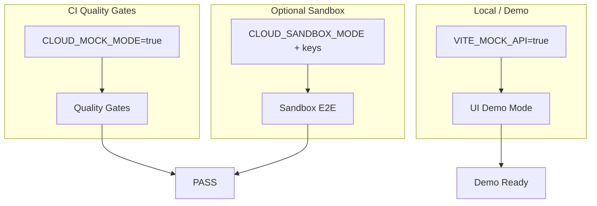

# Production-Standard Mock E2E for All Repos

## Current State (from audit + explore)

| Area               | Status                                                                    | Gap                                                                                                   |
| ------------------ | ------------------------------------------------------------------------- | ----------------------------------------------------------------------------------------------------- |
| **VCR cassettes**  | UAC has `unified_api_contracts_external/<venue>/mocks/`; 46 cassette dirs | `unified-defi-execution-interface`, `execution-service` use per-repo `tests/cassettes/` — not aligned |
| **Libraries**      | Integration tests in 7+ interface repos; UAC/UIC alignment tests          | Orphan cassette check; vcrpy vs manual YAML; cassette placement rule enforcement                      |
| **Services**       | `tests/integration/` in many; CLOUD_MOCK_MODE in base scripts             | API-level mock replay; error/event/load/memory checks; batch vs live symmetry                         |
| **APIs**           | Some conftest fixtures                                                    | Often lack `tests/integration/`; domain data mocking                                                  |
| **UIs**            | `mock-api.ts` + `VITE_MOCK_API` per UI                                    | No shared mock package; smoke coverage gaps; WebSocket mock; demo mode                                |
| **Sandbox**        | Not formalized                                                            | No `CLOUD_SANDBOX_MODE` / `VITE_SANDBOX_MODE` for optional live-like runs                             |
| **GCP emulators**  | None — UCI uses in-memory LocalProvider                                   | No `PUBSUB_EMULATOR_HOST`, `STORAGE_EMULATOR_HOST`, `BIGQUERY_EMULATOR_HOST` in any repo or CI        |
| **AWS mock**       | `unittest.mock.patch` only                                                | No moto; AWS migration active with pending CodeBuild canary                                           |
| **WS feeds**       | UMI WebSocket manager has zero mock coverage                              | No `MockWebSocketFeed`; Deribit WS, Binance WS entirely untested in CI                                |
| **DeFi REST**      | Hyperliquid VCR explicitly excluded (`is_live=True` gate)                 | Full DeFi execution path unreachable in CI without live credentials                                   |
| **Cassette drift** | Static YAML committed to git                                              | No nightly re-record; no cassette → UAC schema parity check; stale cassettes fail silently            |
| **CI hermeticity** | No gate                                                                   | No proof CI makes zero live network calls; TheGraph 9-key rotation fires in CI                        |

---

## Phase 1: Libraries — UAC/UIC + VCR Consolidation

**Goal:** Libraries are production-ready when UAC/UIC validated and every external schema has a VCR cassette with no
orphans.

### 1.1 VCR Cassette SSOT

- **Canonical location:**
  `unified-api-contracts/unified_api_contracts/unified_api_contracts_external/<venue>/mocks/<endpoint>.yaml`
- **Migration:** Move per-repo cassettes from `unified-defi-execution-interface/tests/cassettes/` and
  `execution-service/tests/cassettes/` into UAC under the correct venue paths. Update tests to load from UAC path (or
  via a shared helper).
- **Orphan check:** Add a quality-gate step (or codex check) that fails if any cassette in UAC has no corresponding test
  that replays it, and if any test references a cassette that does not exist.
- **vcrpy vs manual:** Standardize on vcrpy for recording/replay where possible; document manual YAML loading as
  fallback for non-HTTP flows.

### 1.2 External Interfaces (7 repos)

Per [trading_system_audit_prompt.md](unified-trading-pm/plans/audit/trading_system_audit_prompt.md) Section 10:

- `unified-market-interface`, `unified-trade-execution-interface`, `unified-reference-data-interface`,
  `unified-position-interface`, `unified-sports-execution-interface`, `unified-defi-execution-interface`,
  `unified-cloud-interface`
- Each must have VCR-recorded integration tests validating schemas from UAC.
- Cassettes in `unified_api_contracts_external/<venue>/mocks/`.
- All integration tests run with mocked deps (no live cloud in quickmerge).

### 1.3 UIC as SSOT

- UIC schemas are internal SSOT; no separate “validation” beyond contract alignment tests.
- Ensure `test_contract_alignment.py` and `test_ac_uic_alignment.py` (or equivalent) pass in UAC/UIC and dependent
  repos.
- Libraries with private deps: `tests/integration/` with Layer 1.5 mock integration tests per dep boundary.

---

## Phase 2: Services — Mock Replay, Errors, Events, Load, Memory

**Goal:** Services are E2E-testable with mock data in live and batch mode; error handling, event propagation, and
resource behavior validated.

### 2.1 Mock Data Replay

- Each service has `tests/e2e/` or `tests/integration/` scenarios that:
  - Start the service (or its engine) with `CLOUD_MOCK_MODE=true`.
  - Replay mock data from fixtures (aligned with UAC/UIC schemas).
  - Exercise live and batch code paths where applicable.
- Use existing patterns: `tests/fixtures/`, `tests/conftest.py`, `tests/mocks.py` (e.g.
  [deployment-service](deployment-service/tests/mocks.py)).

### 2.2 Error and Config Handling

- Tests for: missing upstream data, missing optional config, partial failures.
- Fail-fast behavior per [hardening-standards.mdc](.cursor/rules/standards/hardening-standards.mdc).
- Add or extend `test_error_handling.py` / `test_config_handling.py` per service.

### 2.3 Event Propagation

- Per [observability-compliance.mdc](.cursor/rules/misc/observability-compliance.mdc): `AUTH_FAILURE`,
  `SECRET_ACCESSED`, `CONFIG_CHANGED`, etc.
- Add `test_event_logging.py` where missing (audit notes 46 repos already have it).
- Assert required events are emitted for key flows.

### 2.4 Load and Performance

- Rate limiting: validate at interface/adapter level (e.g. circuit breaker, backoff).
- Memory: tests that exercise high-volume or long-running flows with mock data; assert no unbounded growth (or document
  expected bounds).
- Use `pytest-benchmark` or similar for regression detection where appropriate.

### 2.5 API-Level Testing

- Services that expose HTTP: smoke tests against `/health`, `/readiness`, and key domain endpoints with mock data.
- Reuse `system-integration-tests` patterns for Layer 3a smoke.

---

## Phase 3: APIs — Same as Services + Domain Data

**Goal:** APIs have the same guarantees as services, plus domain data mocking.

### 3.1 Integration Tests

- Add `tests/integration/` where missing (e.g. [client-reporting-api](client-reporting-api) has conftest but not full
  integration layout).
- One test file per private dependency boundary.

### 3.2 Domain Data Mocking

- Use VCR-style fixtures or in-memory mocks so APIs can run E2E without live services.

### 3.3 Smoke Tests

- `/health`, `/readiness`, and critical GET/POST endpoints with mock payloads.

---

## Phase 4: UIs — Mock API, Smoke, Edge Cases, Demo Mode

**Goal:** UIs are demo- and test-ready with mock data; every screen and flow has smoke coverage; edge cases and
WebSockets covered.

### 4.1 Shared Mock API (Optional)

- Evaluate `@unified-trading/ui-kit` or a new `unified-mock-api` package for shared mock handlers and data shapes.
- Current: each UI has `src/lib/mock-api.ts`; consolidate where it reduces duplication without over-engineering.

### 4.2 Smoke Tests

- Vitest/Playwright: smoke test for every major route and feature.
- Use `VITE_MOCK_API=true` so no real backend required.
- Cover: navigation, forms, tables, charts, error states.

### 4.3 Edge Cases and WebSockets

- Mock WebSocket streams with synthetic data (e.g. random ticks, extreme moves).
- Test: empty states, loading states, error states, large datasets.
- Scenarios: extreme loads, flash crashes, missing instruments.

### 4.4 Demo Mode

- `VITE_MOCK_API=true` as default for local dev and CI.
- Document how to run UIs in “demo mode” for stakeholders.

---

## Phase 5: Sandbox and Extreme Scenarios

**Goal:** Optional sandbox mode for CI when secrets present; synthetic extreme scenarios for load and market moves.

### 5.1 Sandbox Mode

- **Env vars:** `CLOUD_SANDBOX_MODE`, `VITE_SANDBOX_MODE` (or equivalent).
- **Behavior:** When set and sandbox/UAT API keys are available, tests can call real sandbox endpoints.
- **CI:** Default remains mock-only; add optional job or flag (e.g. `--sandbox`) to run sandbox tests when secrets
  exist.
- **Docs:** Document in [dev-environment-vars.md](unified-trading-pm/docs/dev-environment-vars.md).

### 5.2 Extreme Scenarios

- Fixtures for: high message volume, extreme price moves, missing instruments, partial failures.
- Replay these in services and UIs to validate stability and UX under stress.

---

## Phase 6: Quality Gates and Rollout

### 6.1 Quality Gate Updates

- Add cassette orphan check to UAC (or codex step).
- Add `tests/integration/` presence check for services and APIs (or extend existing).
- Ensure `CLOUD_MOCK_MODE=true` in all Python repo workflows (per
  [mft_audit_full_remediation_2026_03_11.md](unified-trading-pm/plans/active/mft_audit_full_remediation_2026_03_11.md)).
- UI repos: ensure `VITE_MOCK_API` is set in CI for test runs.

### 6.2 Rollout Order

1. **Libraries** (T0/T1): UAC, UIC, interfaces — cassette consolidation, orphan check.
2. **Services** (T2/T3): mock replay, error/event/load tests.
3. **APIs**: integration tests, domain mocks, smoke.
4. **UIs**: smoke, edge cases, WebSocket mocks, demo mode.
5. **Sandbox + extreme**: optional modes and fixtures.

### 6.3 Repo Inventory

- Use `workspace-manifest.json` to enumerate repos by `type` and `arch_tier`.
- Create checklist per repo: VCR, integration tests, mock replay, events, load, smoke, sandbox.

---

## Key Files and References

| Reference                                                                                       | Purpose                                       |
| ----------------------------------------------------------------------------------------------- | --------------------------------------------- |
| [trading_system_audit_prompt.md](unified-trading-pm/plans/audit/trading_system_audit_prompt.md) | Audit Sections 10 (integration), 14 (orphans) |
| [integration-testing-layers.mdc](.cursor/rules/testing/integration-testing-layers.mdc)          | 5-layer strategy; cassette placement          |
| [CI-CD-FLOW.md](unified-trading-pm/docs/repo-management/CI-CD-FLOW.md)                          | run-all-quality-gates, CLOUD_MOCK_MODE        |
| [observability-compliance.mdc](.cursor/rules/misc/observability-compliance.mdc)                 | Event requirements                            |
| `unified_api_contracts_external/<venue>/mocks/`                                                 | Canonical cassette location                   |

---

## Mermaid: Test Mode Flow

---

## Success Criteria

- **Libraries:** UAC/UIC alignment pass; every external schema has a cassette; zero cassette orphans.
- **Services/APIs:** Integration tests per dep boundary; mock replay in live and batch; error/event/load tests; smoke on
  key endpoints.
- **UIs:** Smoke tests for all major flows; mock API and WebSocket; demo mode works.
- **Sandbox:** Optional CI mode when secrets present; documented.
- **Extreme:** Fixtures and scenarios for load and market stress; replayable in tests.
- **CI hermeticity (Phase 7):** Zero live network calls in CI proven by credential-free gate; all cassettes validate
  against UAC schemas; GCP emulators + moto replace all live cloud calls.

---

## Phase 7: CI/CD Hardening — Citadel-Grade Mock Infrastructure

**Goal:** Prove CI is fully hermetic (zero live calls), cloud interactions are protocol-faithful, and cassettes never
silently diverge from real exchange APIs.

### 7.1 Credential-Free CI Gate (H8) — P0

- **New pytest plugin:** `unified-trading-pm/scripts/dev/network_block_plugin.py`
  - Registers `responses` in `passthrough=False` mode for the full session
  - Any unexpected network call → immediate test failure with URL logged
- **CI step** in `system-integration-tests` workflow:
  `CLOUD_PROVIDER=local CLOUD_MOCK_MODE=true pytest -m "not sandbox"`
- **Gate:** CI exits non-zero if any test makes a live network call

### 7.2 Cassette → UAC Schema Parity (H5.2) — P0

- **New file:** `unified-api-contracts/tests/test_cassette_schema_parity.py`
- Loads every YAML cassette from all `unified_api_contracts_external/<venue>/mocks/` dirs
- Validates response body against the corresponding UAC Pydantic model
- Runs on every commit (fast — no network); fails QG on schema violation
- Catches stale cassettes that recorded responses now violating current contracts

### 7.3 AWS Mock via moto (H2) — P1

- **Add to** `unified-cloud-interface/pyproject.toml` test deps: `"moto[s3,secretsmanager,sqs]>=5.0.0,<6.0.0"`
- **New file:** `unified-cloud-interface/tests/integration/test_aws_mode.py`
  - `@mock_aws` wrapping all S3StorageClient, AWSSecretClient, SQS queue tests
  - Protocol-faithful: real bucket/key semantics in memory
- **Gate for** `aws_migration.md` `codebuild-canary-run` todo: moto tests must pass first

### 7.4 GCP Pub/Sub Emulator (H1.1) — P1

- **Env:** `PUBSUB_EMULATOR_HOST=localhost:8085` — `google-cloud-pubsub` SDK auto-detects; no code changes
- **CI:** Add Docker service `gcr.io/google.com/cloudsdktool/google-cloud-cli` before test suite
- **conftest.py** fixture in `system-integration-tests/` and per-service integration dirs
- **Scope:** Any test exercising `log_event()`, `EventBus.publish()`, subscription pull

### 7.5 Hyperliquid `responses` Mock (H4.1) — P1

- **New file:** `unified-defi-execution-interface/tests/fixtures/hyperliquid_responses.py`
  - `@responses.activate` wrapping order placement, cancellation, status query
  - `passthrough=False` asserted — zero live calls escape
- **Note:** VCR not applicable for this repo; `responses` library is the correct pattern
- Unblocks the entire DeFi execution path in CI without live credentials

### 7.6 GCS Emulator (H1.2) — P2

- **Docker:** `fsouza/fake-gcs-server:latest` port `4443`
- **Env:** `STORAGE_EMULATOR_HOST=http://localhost:4443`
- **Scope:** bucket lifecycle, ACLs, signed URL generation — not covered by UCI LocalStorageProvider
- Required by `cloud_infra_bucket_auth_2026_03_10.md` tests

### 7.7 WebSocket Feed Simulator (H3) — P2

- **New file:** `unified-market-interface/tests/fixtures/mock_ws_server.py`
  - `MockWebSocketFeed` — replays JSON tick fixtures over a local WS server (aiohttp.test_utils)
- **Fixture files:** `ws_ticks_binance.json`, `ws_ticks_deribit.json`, `ws_ticks_hyperliquid.json` (UAC-validated)
- **Tests:** `unified-market-interface/tests/integration/test_ws_manager.py`,
  `execution-service/tests/integration/test_deribit_ws.py`

### 7.8 Third-Party Data Provider Fixtures (H7) — P2

| Provider                                  | Fix                                                                                                       |
| ----------------------------------------- | --------------------------------------------------------------------------------------------------------- |
| **TheGraph** (9-key rotation fires in CI) | `aioresponses` fixtures per query hash in `unified-market-interface/tests/fixtures/thegraph_responses.py` |
| **Alchemy/Infura** (live RPC)             | `responses` fixtures for JSON-RPC `eth_call` patterns                                                     |
| **Databento, Tardis**                     | Complete VCR cassette coverage for all used endpoints                                                     |
| **Pyth, BloxRoute**                       | Fixtures if used in any production code path                                                              |

### 7.9 Fault Injection / Chaos Middleware (H6) — P3

- **New file:** `unified-trading-pm/scripts/dev/fixtures/fault_injection.py`
  - `FaultInjectionMiddleware(latency_ms, error_rate, timeout_rate)` for httpx/aiohttp
- **Test files:** `test_fault_scenarios.py` in execution-service, market-data-service, UCI
- **Scenarios:** timeout → circuit breaker opens; 429 → backoff; 50% error → degraded mode; cascade → alert event

### 7.10 Deterministic Tick Replay Engine (H9) — P3

- **New file:** `unified-trading-pm/scripts/dev/fixtures/tick_replay.py`
  - `TickReplayEngine` reads from `mock_data_dev_project` seed fixtures
  - `freezegun` for deterministic time; UAC `Tick` schema validation
- **Depends on:** `mock_data_dev_project_seeding_2026_03_10.md` seed fixtures

### 7.11 BigQuery Emulator (H1.3) — P3

- **Docker:** `ghcr.io/goccy/bigquery-emulator:latest` port `9050`
- **Env:** `BIGQUERY_EMULATOR_HOST=localhost:9050`
- **Scope:** trading-analytics-api, client-reporting-api DataSink writes

### 7.12 Nightly Cassette Drift Detection (H5.1) — P4

- **Workflow:** `unified-trading-pm/.github/workflows/cassette-drift-check.yml` — nightly 02:00 UTC
- Re-records cassettes against real APIs; schema-level diff (not byte diff) via Pydantic
- On drift: GitHub issue + Telegram alert (alerting-only, not blocking CI)

### 7.13 docker-compose.mock.yml + Demo Mode (H10) — P4

- **`unified-trading-pm/docker/docker-compose.mock.yml`** — all T2/T3 services in mock mode; optional GCP emulators;
  seed mounts
- **`unified-trading-pm/scripts/demo-mode.sh`** — single command: services + UIs (VITE_MOCK_API=true) + seeded data

---

### 7.x Venue / API Coverage Matrix

| Domain           | Venues                                                     | Current CI State             | After Phase 7       |
| ---------------- | ---------------------------------------------------------- | ---------------------------- | ------------------- |
| CeFi execution   | Binance, Coinbase, ByBit, OKX, Deribit, Hyperliquid, Upbit | `mode="sim"` ✓               | + fault injection   |
| TradFi execution | CME, CBOE, NYSE, NASDAQ, ICE, FX (IBKR)                    | `MagicMock(spec=IB)` ✓       | + WS TWS mock       |
| DeFi execution   | Hyperliquid REST, Aave, Morpho, Uniswap, Lido, EtherFi     | Hyperliquid excluded ✗       | H4.1 `responses` ✓  |
| Sports execution | 1xBet + others                                             | `aioresponses` + VCR ✓       | Complete cassettes  |
| Market data WS   | Binance WS, Deribit WS, OKX WS                             | No mock ✗                    | H3 WS simulator ✓   |
| Market data REST | Databento, Tardis, Yahoo Finance                           | VCR partial                  | H7 complete         |
| Market data DeFi | TheGraph, Alchemy, Pyth, BloxRoute                         | Live calls in CI ✗           | H7 `aioresponses` ✓ |
| Cloud infra GCP  | GCS, Pub/Sub, Secret Manager, BigQuery                     | LocalProvider partial        | H1 emulators ✓      |
| Cloud infra AWS  | S3, SQS, Secrets Manager                                   | `unittest.mock.patch` only ✗ | H2 moto ✓           |
| Reference data   | Databento, Tardis, OpenBB, FRED, ECB                       | VCR partial                  | H7 complete         |
