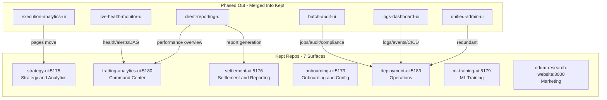

# UI Consolidation and UX Hardening Plan

## Surface Architecture (7 Surfaces, Existing Repo Names)



## Surface Definitions

### 1. Command Center -- `trading-analytics-ui` (port 5180)

**Purpose**: Fund-level overview with drill-down. The first thing you see.

**Routes (revised)**:

- `/` -- Fund dashboard: total PnL, health status, top alerts, strategy performance grid
- `/pnl` -- PnL drill-down: fund-level waterfall, then filter by client/strategy/instrument
- `/pnl/client/:clientId` -- Client PnL breakdown by strategy
- `/pnl/strategy/:strategyId` -- Strategy PnL (cross-links to strategy-ui for deep dive)
- `/risk` -- Risk matrix with dimensional grouping (by client, by strategy, by instrument type)
- `/positions` -- All positions, grouped/filterable by client > strategy > instrument
- `/orderbook` -- Order book viewer (existing)
- `/latency` -- Latency dashboard (existing)
- `/recon` -- Reconciliation runs (existing, absorb from execution-analytics-ui too)
- `/health` -- System health grid + dependency DAG (from live-health-monitor-ui)
- `/alerts` -- Alert management (from live-health-monitor-ui)

**Absorbs from**:

- `live-health-monitor-ui`: DashboardPage (positions/risk/health), SystemHealthPage, AlertsPage, DependencyDagPage
- `client-reporting-ui`: PerformancePage (monthly returns, Sharpe, by-client breakdown)
- Already has: TradingDeskPage, PnLWaterfallPage, RiskMatrixPage, OrderBookPage, LatencyPage, ReconRunsPage/DetailPage

**Removes**: `/deployments` route, `/trading-desk` manual order entry (move to a dedicated action within positions view
or keep as a sub-tab)

**Key UX**: The landing page (`/`) shows a KPI grid (total AUM, daily PnL, Sharpe, drawdown, active strategies count,
alerts count) plus a sortable strategy performance table with sparklines. Every strategy name is a `CrossLink` to
`strategy-ui`. Every client name is a `CrossLink` that filters the current view.

### 2. Strategy and Analytics -- `strategy-ui` (port 5175)

**Purpose**: Strategy lifecycle from config to backtest to live to execution analysis.

**Routes (revised)**:

- `/` -- Strategy list: filterable grid (type, client, status, asset class), search, sort by Sharpe/return/drawdown
- `/strategies/:id` -- Strategy detail: config, parameters, venues, risk limits, allocation
- `/strategies/:id/backtest` -- Run backtest (from execution-analytics-ui RunBacktest)
- `/strategies/:id/results` -- Backtest results: equity curve, metrics, daily PnL
- `/strategies/:id/live` -- Live dashboard: real-time positions, exposure, risk, alerts
- `/strategies/:id/execution` -- Execution analytics: fills on tick data, TCA, alpha decomposition, slippage
- `/strategies/:id/deep-dive/:configId` -- Deep dive (user picks strategy-level or execution-level tab)
- `/grid` -- Grid results: multi-strategy comparison matrix
- `/compare` -- Algorithm comparison (overlay equity curves)
- `/configs` -- Config browser (all configs across strategies)
- `/generate` -- Config generator
- `/instruments` -- Instrument definitions
- `/availability` -- Instruction availability

**Absorbs from**:

- `execution-analytics-ui`: ALL pages (RunBacktest, LoadResults, GridResults, Analysis, DeepDive, AlgorithmComparison,
  ConfigBrowser, ConfigGenerator, InstrumentDefinitions, InstructionAvailability, MarketTickData)

**Key distinction preserved**: Strategy analytics (position-based PnL, candlestick granularity, hold periods) vs
execution analytics (trade-based PnL, tick granularity, fill analysis) are **separate tabs** within a strategy's detail
view, not separate pages. The user selects a strategy first, then chooses the analytics lens.

**Key UX**: The strategy list at `/` is the primary entry point. Cards or rows show strategy name, type badge
(DeFi/CeFi/TradFi/Sports), status (live/backtest/paper), key metrics (Sharpe, return, drawdown) with sparklines.
Clicking a strategy opens its detail view with tabs. Filters at the top: client dropdown, strategy type, asset class,
status, date range, search.

### 3. Operations -- `deployment-ui` (port 5183)

**Purpose**: Everything operational -- deploy, build, monitor jobs, view logs.

**Routes (revised, absorbing batch-audit + logs)**:

- `/` -- Services overview grid (existing ServicesOverviewTab)
- `/services/:name` -- Service detail with tabs (Deploy, Data Status, Builds, Readiness, Status, Config, History)
- `/epics` -- Epic readiness view (existing)
- `/jobs` -- Batch jobs list (from batch-audit-ui BatchJobsPage)
- `/jobs/:id` -- Job detail (from batch-audit-ui JobDetailPage)
- `/audit` -- Audit trail (from batch-audit-ui AuditTrailPage)
- `/compliance` -- Compliance view (from batch-audit-ui CompliancePage)
- `/data-health` -- Data completeness (from batch-audit-ui DataCompletenessPage)
- `/logs` -- Log viewer (from logs-dashboard-ui LogsView)
- `/logs/:id` -- Log detail (from logs-dashboard-ui LogDetail)
- `/events` -- Events viewer (from logs-dashboard-ui EventsView)
- `/cicd` -- CI/CD status (from logs-dashboard-ui CICDView)

**Absorbs from**:

- `batch-audit-ui`: BatchJobsPage, JobDetailPage, AuditTrailPage, DataCompletenessPage, CompliancePage
- `logs-dashboard-ui`: LogsView, LogDetail, EventsView, AlertsView, CICDView
- `unified-admin-ui`: Redundant (already duplicates batch-audit + deployment content)

**Nav structure**: Group into sections in sidebar -- "Deploy" (services, epics), "Batch" (jobs, data health), "Observe"
(logs, events, audit, CI/CD), "Compliance" (compliance view).

### 4. Onboarding and Config -- `onboarding-ui` (port 5173)

**Purpose**: CRUD for clients, strategies, venues, API keys, risk config. Config publishing.

**Routes (trimmed)**:

- `/clients`, `/clients/:id` -- Client CRUD
- `/strategies`, `/strategies/:id` -- Strategy CRUD (cross-links to strategy-ui for analytics)
- `/venues`, `/venues/:id` -- Venue CRUD
- `/venue-connections` -- Venue connection status
- `/api-keys` -- API key management
- `/credentials` -- Credential status
- `/risk` -- Risk configuration
- `/strategy-manifest` -- Strategy manifest (read-only, from UAC registry)

**Removes**: `/deployments` (go to deployment-ui), `/audit` (go to deployment-ui `/audit`)

**Key UX**: Wizard-style flows for creating new clients/strategies/venues. Each entity detail page has a "View
Analytics" cross-link to the appropriate surface (strategy detail in strategy-ui, client PnL in trading-analytics-ui).
Config publishing workflow: edit config -> review diff -> publish to config-api -> shows propagation status.

### 5. Settlement and Reporting -- `settlement-ui` (port 5176)

**Purpose**: Position settlement, invoicing, PnL residuals, report generation.

**Routes (revised, absorbing client-reporting generation)**:

- `/` -- Settlement dashboard with summary stats
- `/positions` -- Position status with settlement context
- `/settlements` -- Settlement list, filterable by client/strategy/period
- `/settlements/:id` -- Settlement detail with confirm workflow
- `/invoices` -- Invoice management
- `/reports` -- Report list (from client-reporting-ui ReportsPage)
- `/reports/generate` -- Report generation form (from client-reporting-ui GenerateReportPage)
- `/residuals` -- PnL residuals and attribution

**Absorbs from**:

- `client-reporting-ui`: ReportsPage, GenerateReportPage (the report CRUD and generation workflow)

**Removes**: `/deployments`

### 6. ML Training -- `ml-training-ui` (port 5179) -- No changes to scope

**Removes**: `/deployments` route only. Cross-link to deployment-ui for deploy actions.

### 7. Odum Research Website -- `odum-research-website` (port 3000) -- No changes

---

## Shared Infrastructure (ui-kit Additions)

All new components go into [unified-trading-ui-kit/src/](unified-trading-ui-kit/src/).

### A. Surface Registry and Cross-Linking

New file: `src/lib/surface-registry.ts`

```typescript
export const SURFACES = {
  commandCenter: {
    name: "Trading Analytics",
    port: 5180,
    repo: "trading-analytics-ui",
  },
  strategyAnalytics: {
    name: "Strategy & Analytics",
    port: 5175,
    repo: "strategy-ui",
  },
  operations: { name: "Operations", port: 5183, repo: "deployment-ui" },
  onboarding: { name: "Onboarding", port: 5173, repo: "onboarding-ui" },
  settlement: { name: "Settlement", port: 5176, repo: "settlement-ui" },
  mlTraining: { name: "ML Training", port: 5179, repo: "ml-training-ui" },
} as const;

export type SurfaceKey = keyof typeof SURFACES;

export function buildCrossLink(
  surface: SurfaceKey,
  path: string,
  params?: Record<string, string>,
): string {
  const s = SURFACES[surface];
  const base =
    import.meta.env.VITE_SURFACE_BASE_URL ?? `http://localhost:${s.port}`;
  const url = new URL(path, base);
  if (params) {
    for (const [k, v] of Object.entries(params)) url.searchParams.set(k, v);
  }
  return url.toString();
}
```

`VITE_SURFACE_BASE_URL` override lets production routing work when all surfaces share one domain with path prefixes.

### B. CrossLink Component

New file: `src/components/ui/cross-link.tsx`

- Renders `<a>` with correct href from surface registry
- Supports entity shortcuts:
  `<CrossLink surface="strategyAnalytics" entity="strategy" id="BASIS_TRADE">Basis Trade</CrossLink>` generates
  `/strategies/BASIS_TRADE`
- Visual indicator (subtle external-link icon) to signal cross-surface navigation

### C. GlobalNavBar Component

New file: `src/components/ui/global-nav-bar.tsx`

- Horizontal bar at the very top of every surface (above AppHeader)
- Shows all 6 surface names as links (using surface registry)
- Highlights current surface
- Compact: single row, 32px height, minimal visual footprint
- Includes a global search input (fuzzy across strategies, clients, instruments)

### D. FilterBar Component

New file: `src/components/ui/filter-bar.tsx`

- Reusable filter bar with configurable filter slots
- Built-in filters: Client (dropdown with search), Strategy (dropdown with search), Date Range (date picker), Instrument
  Type (multi-select), Status (multi-select)
- URL-based state: reads/writes query params so filters survive refresh and can be shared via URL
- Entity counts shown per filter option (e.g., "Binance (12 strategies)")
- "Clear all" button

### E. EntityLink Component

New file: `src/components/ui/entity-link.tsx`

- Wraps any entity name (strategy, client, instrument, service) in a clickable link
- Maps entity type to the correct surface and path automatically
- `<EntityLink type="strategy" id="BASIS_TRADE">Basis Trade</EntityLink>` -> links to strategy-ui
  `/strategies/BASIS_TRADE`
- `<EntityLink type="client" id="FUND_A">Fund A</EntityLink>` -> links to trading-analytics-ui `/pnl/client/FUND_A`

### F. BreadcrumbNav Component

New file: `src/components/ui/breadcrumb-nav.tsx`

- Shows hierarchical navigation path: Fund > Client X > Strategy Y > Position Z
- Each level is clickable (navigates to that level's view)
- Supports cross-surface breadcrumbs (client level links to command center, strategy level links to strategy-ui)

### G. SparklineCell Component

New file: `src/components/ui/sparkline-cell.tsx`

- Inline SVG sparkline for table cells
- Shows PnL trend, equity curve mini, or latency trend
- Green/red coloring based on direction

### H. Visual Polish (globals.css updates)

Update [unified-trading-ui-kit/src/globals.css](unified-trading-ui-kit/src/globals.css):

- Increase border-radius: `--radius-md: 8px`, `--radius-lg: 12px`, `--radius-xl: 16px` (rounder, more modern)
- Add subtle transitions: `--transition-default: 150ms ease` on all interactive elements
- Add hover states with gentle elevation (`box-shadow` on hover for cards)
- Refine spacing: more breathing room between sections
- Add `--color-pnl-positive` and `--color-pnl-negative` semantic tokens

---

## Cross-Linking Entity Map

Every entity type maps to a canonical surface and deep-link path:

- **Strategy** -> `strategy-ui /strategies/:id`
- **Client** -> `trading-analytics-ui /pnl/client/:id`
- **Instrument** -> `strategy-ui /instruments?q=:symbol`
- **Position** -> `trading-analytics-ui /positions?strategy=:strategyId`
- **Settlement** -> `settlement-ui /settlements/:id`
- **Service** -> `deployment-ui /services/:name`
- **Batch Job** -> `deployment-ui /jobs/:id`
- **Experiment** -> `ml-training-ui /experiments/:id`
- **Report** -> `settlement-ui /reports/:id`

---

## Phased Rollout

### Phase 0: Shared Infrastructure (ui-kit)

Add surface registry, CrossLink, GlobalNavBar, FilterBar, EntityLink, BreadcrumbNav, SparklineCell to ui-kit. Update
globals.css for visual polish. No breaking changes to existing UIs.

### Phase 1: Quick Wins (all UIs)

- Remove `/deployments` route from all non-operations UIs (10 UIs lose their DeploymentPanel page)
- Add GlobalNavBar to all 7 kept UIs (one-line `AppShell` prop or wrapper)
- Add EntityLink where entity names appear in tables (strategy names, client names become clickable)

### Phase 2: Merge execution-analytics-ui into strategy-ui

- Move all execution-analytics-ui pages into strategy-ui under strategy-scoped routes
- Add strategy/execution tab split in strategy detail view
- Update strategy-ui nav to include new sections
- execution-analytics-ui becomes a redirect shell (all routes redirect to strategy-ui equivalents)

### Phase 3: Build Command Center in trading-analytics-ui

- Add `/` fund dashboard with KPI grid + strategy performance table
- Add `/health`, `/alerts` pages (from live-health-monitor-ui)
- Add dimensional PnL drill-down (`/pnl/client/:id`, `/pnl/strategy/:id`)
- Add `/positions` with grouping by client > strategy
- Absorb client-reporting-ui performance view
- live-health-monitor-ui becomes a redirect shell

### Phase 4: Merge ops UIs into deployment-ui

- Add `/jobs`, `/audit`, `/compliance`, `/data-health` pages (from batch-audit-ui)
- Add `/logs`, `/events`, `/cicd` pages (from logs-dashboard-ui)
- Update sidebar nav with grouped sections
- batch-audit-ui, logs-dashboard-ui, unified-admin-ui become redirect shells

### Phase 5: Clean up settlement-ui + onboarding-ui

- Move report generation from client-reporting-ui into settlement-ui
- Remove `/deployments` and `/audit` from onboarding-ui
- client-reporting-ui becomes a redirect shell

### Phase 6: UX Hardening across all surfaces

- Add FilterBar to all list views (strategies, positions, settlements, jobs, logs)
- Add BreadcrumbNav to all drill-down views
- Add SparklineCell to all performance tables
- Add search/autocomplete to GlobalNavBar
- Responsive design pass (mobile-friendly tables, collapsible sidebar)
- Accessibility pass (keyboard navigation, ARIA labels, focus management)

---

## UI-to-API Mapping (Post-Consolidation)

| Surface              | APIs consumed                                              |
| -------------------- | ---------------------------------------------------------- |
| trading-analytics-ui | trading-analytics-api (8012), execution-results-api (8006) |
| strategy-ui          | execution-results-api (8006)                               |
| deployment-ui        | deployment-api (8004), batch-audit-api (8013)              |
| onboarding-ui        | config-api (8005)                                          |
| settlement-ui        | trading-analytics-api (8012), client-reporting-api (8014)  |
| ml-training-ui       | ml-training-api (8011)                                     |

No API changes required. UIs that absorb pages from other UIs simply add the corresponding API base URL as an additional
Vite proxy target.
